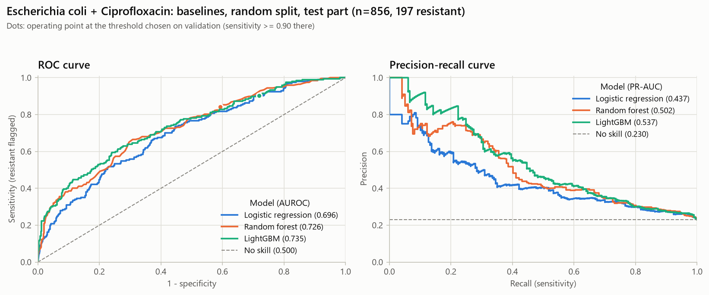
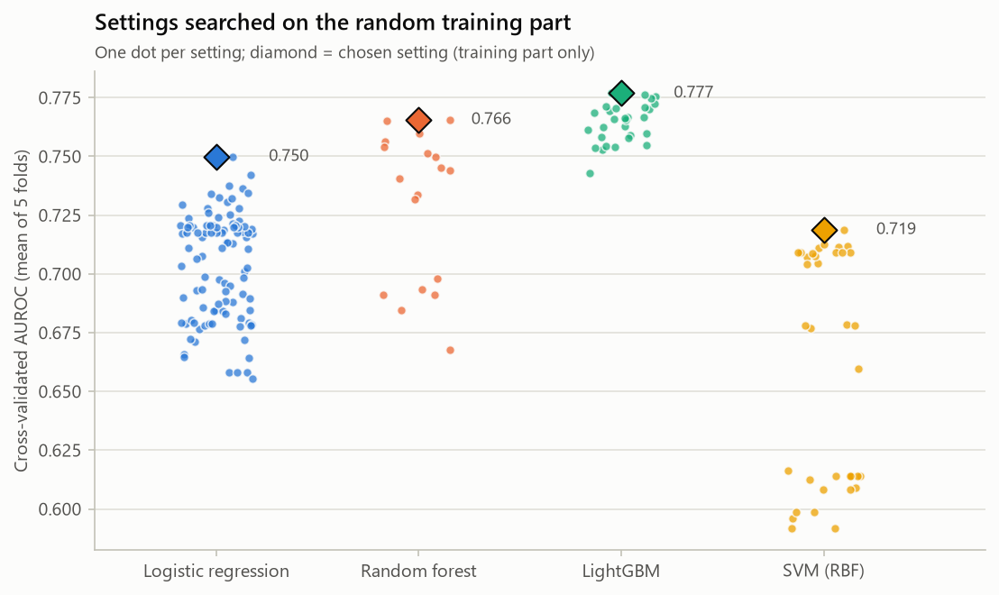
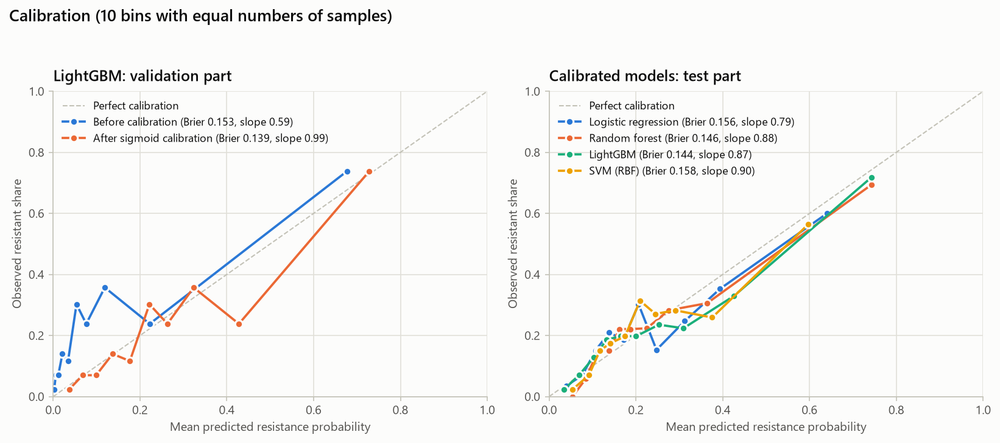
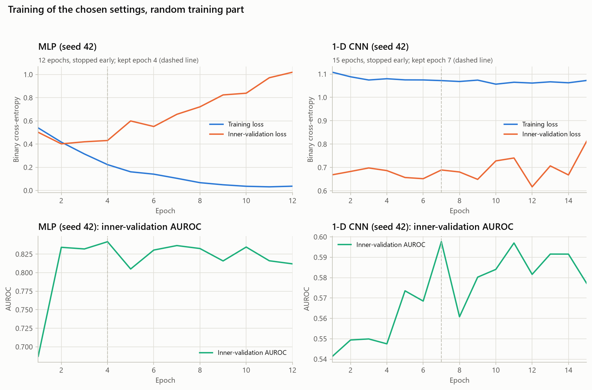
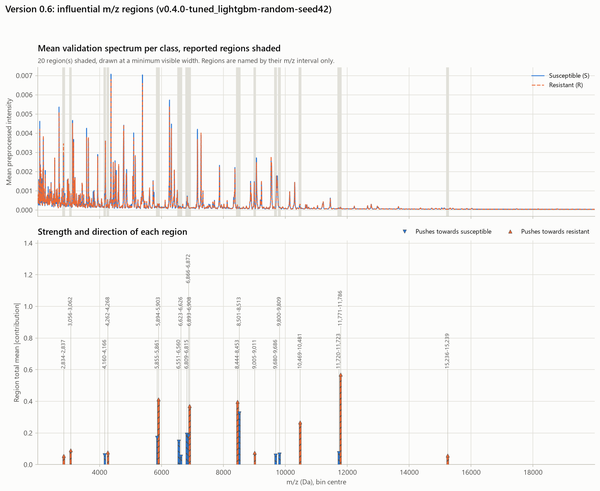
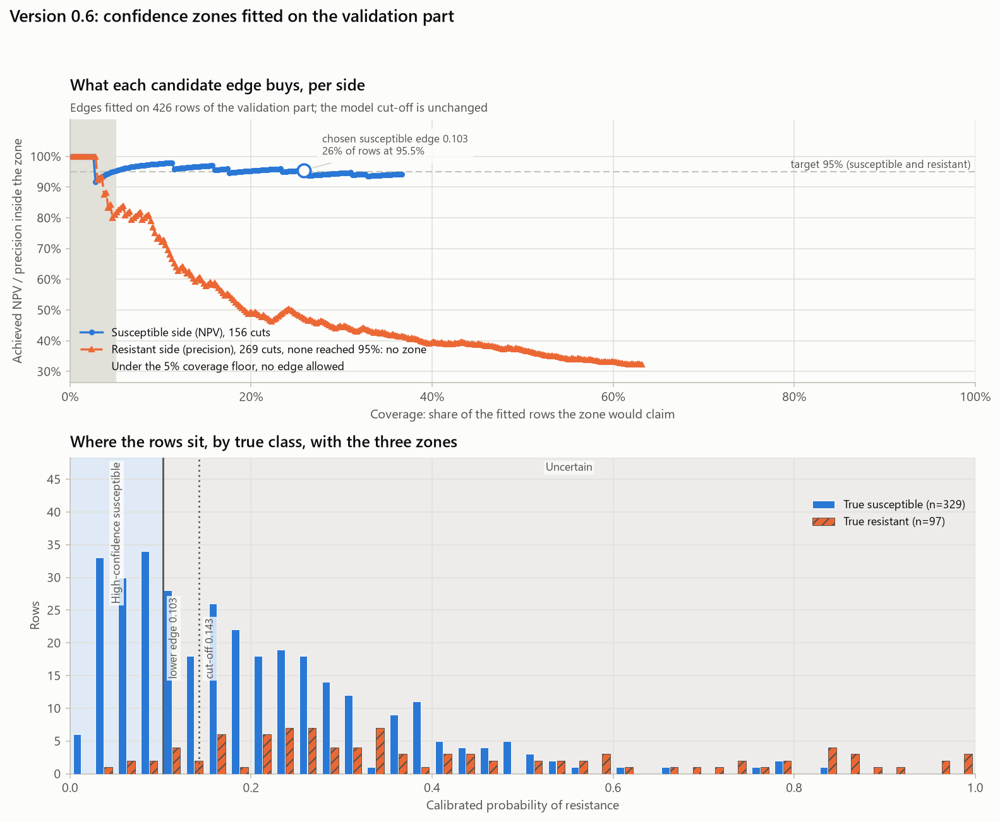
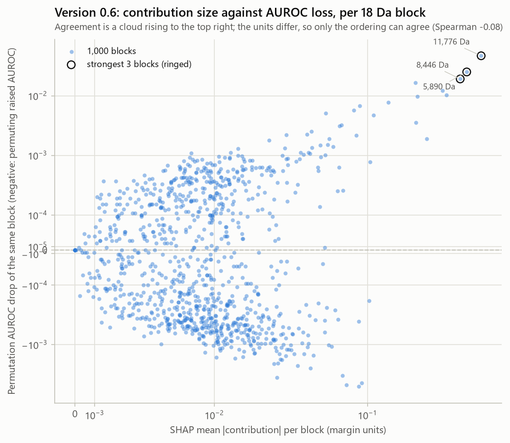

# Adaptive AI for Rapid Antibiotic Resistance Prediction from MALDI-TOF Mass Spectrometry Data

[](https://github.com/Sickwoman/antibiotic-resistance-ai/actions/workflows/tests.yml)
[](LICENSE)

> **Research prototype only.** This project is not intended to replace laboratory antimicrobial
> susceptibility testing (AST) or professional medical decision-making, and it never recommends
> treatments. All outputs are AI research predictions on a public, de-identified dataset.

**Status: Version 0.6 – evaluation and explainability.** Versions 0.1 (download + exploration), 0.2
(preprocessing, dataset, splits), 0.3 (baseline models), 0.4 (tuning and calibration) and 0.5 (neural
networks) are complete. Models are evaluated as fixed in
[`docs/evaluation_protocol.md`](docs/evaluation_protocol.md), approved before any model was trained; the
Version 0.4 search was fixed in [`docs/v0.4_search_plan.md`](docs/v0.4_search_plan.md) before any model
was tuned, the Version 0.5 networks in
[`docs/v0.5_deep_learning_plan.md`](docs/v0.5_deep_learning_plan.md) before any network was trained, and
the Version 0.6 explanations in
[`docs/v0.6_explainability_plan.md`](docs/v0.6_explainability_plan.md) before anything was explained.
**The networks did not beat the classical models**, so the tuned LightGBM of Version 0.4 remains the
project's model — see [Version 0.5](#version-05--neural-networks-mlp-and-1-d-cnn). It can now say which
m/z regions moved a prediction, and it can answer *uncertain* instead of forcing a call — but only on the
susceptible side; see [Version 0.6](#version-06--evaluation-and-explainability).
The complete README (architecture, training, results, limitations, ethics) is written at Version 1.0,
once real results exist.

## The idea in simple words

Laboratories normally run AST to find out whether bacteria are resistant to an antibiotic, which takes
time. Many laboratories already record a MALDI-TOF mass spectrum of each isolate to identify the
species. This project trains a model on historical examples where both the spectrum and the true AST
result are known, and then estimates the probability of resistance for a new spectrum within seconds.
The main research question is whether such a model **keeps working across hospitals and time periods**,
and whether adaptation or retraining helps when it does not.

## Dataset: DRIAMS (verified 2026-09-16)

- **DRIAMS** – Database of Resistance Information on Antimicrobials and MALDI-TOF Mass Spectra
  (Weis et al., *Nature Medicine* 2022). License CC0.
- Sources: [Dryad doi:10.5061/dryad.bzkh1899q](https://datadryad.org/dataset/doi:10.5061/dryad.bzkh1899q)
  (current version, Aug 2025) and [Zenodo record 5640517](https://zenodo.org/records/5640517) (v1).

| Site | Institution | Period | Archive | Size |
|---|---|---|---|---|
| DRIAMS-A | University Hospital Basel | 11/2015–08/2018 | `DRIAMS_A.tar.gz` | 86.16 GB |
| DRIAMS-B | Canton Hospital Basel-Land | 01–06/2018 | `DRIAMS_B.tar.gz` | 3.69 GB |
| DRIAMS-C | Canton Hospital Aarau | 01–08/2018 | `DRIAMS_C.tar.gz` | 12.43 GB (Dryad version) |
| DRIAMS-D | Viollier AG (laboratory) | 01–06/2018 | `DRIAMS_D.tar.gz` | 42.56 GB |

Total ≈ 145 GB compressed. Exact byte sizes and checksums are in `config.yaml`.
Dryad replaced `DRIAMS_C.tar.gz` in Aug 2025 (raw-file naming fix), so C must come from Dryad.
Dryad refuses scripted downloads, so C is downloaded in a browser; A, B and D download from Zenodo by script.

Layout inside every archive:

```
DRIAMS-X/
├── raw/<year>/<code>.txt           raw spectrum: '#' comments, header, "m/z intensity" rows (~20,800 rows)
├── preprocessed/<year>/<code>.txt  spectrum after the published preprocessing pipeline
├── binned_6000/<year>/<code>.txt   header "bin_index binned_intensity", 6,000 rows (3 Da bins)
└── id/<year>/<year>_clean.csv      metadata: species, code and one column per antibiotic (R / I / S)
```

What we found in the real files (details in `results/metrics/eda/`):

**DRIAMS-A** (University Hospital Basel)
- 145,341 raw and preprocessed spectra (matches the paper); 111,257 metadata rows, each with a
  binned spectrum (2015: 3,198 · 2016: 34,868 · 2017: 43,122 · 2018: 30,069).
- Each year has `<year>_clean.csv` and `<year>_strat.csv` with identical rows and identical antibiotic
  values; `strat` adds `patient_no`, `case_no`, `order_no`, `acquisition_date`, `acquisition_time` and
  `workstation`, so the loader uses `strat`. `id/2016` also contains a macOS `._` metadata file (ignored).
- `patient_no` / `case_no` are 32-character hashes that never repeat across years, so patients can be
  grouped within a year but not followed across years.
- 232 spectra in the 2018 folder were acquired in 2017.
- Three E. coli "patients" have 274–533 spectra each under a single case and order, spread over
  months and all sample types – most likely placeholder IDs. None of them has a ciprofloxacin result.
- E. coli from hospital-hygiene samples are 78 % ciprofloxacin-resistant versus 20–32 % for the
  clinical sample types – a possible shortcut that must be handled in modelling.

**DRIAMS-B** (Canton Hospital Basel-Land)
- `2018_clean.csv` has 5,897 rows and 47 columns: `species`, `code`, `combined_code` (empty),
  40 antibiotic columns with R/I/S values and 4 screening columns with 0/1 values
  (`ESBL`, `MRSA`, `Cefoxitin_screen`, `Clindamycin_induced`).
- No `patient_no`, `case_no`, `acquisition_date` or `workstation` column.
- `binned_6000` exists only for the 2,386 samples that have resistance results; `raw` and
  `preprocessed` have 6,416 files each.

**DRIAMS-D** (Viollier AG, diagnostic laboratory; checked 2026-09-17)
- `id/2018/2018_clean.csv` has 10,436 rows and 55 columns: `code`, `species`, `genus` and 52 antibiotic
  columns. 16 of these are completely empty, and `Cefuroxime` appears twice in the header.
- No `patient_no`, `case_no`, `acquisition_date` or `workstation` column (like DRIAMS-B).
- Codes are 41 characters: a UUID plus `_3312` or `_3313`. The meaning of this suffix is not documented.
  `raw`, `preprocessed` and `binned_6000` files carry the same name.
- 75,813 raw and preprocessed spectra, of which only 10,436 have a metadata row. Every metadata row has a
  binned spectrum.
- 54 species strings, with no failed identifications and no mixed cultures.
- `Cotrimoxazole` holds only R values (1,280 rows, not a single S), so that column looks selectively
  reported.

**Across sites:**
- Some antibiotic names differ (e.g. `Cotrimoxazole` in A and D, `Cotrimoxazol` in B). Ciprofloxacin and
  ceftriaxone are spelled the same everywhere.
- No spectrum code appears at more than one site.

### Disk space

About 145 GB for all four archives, plus the extracted folders. Only `id/` and `binned_6000/` are
extracted in Version 0.1, which is much smaller: DRIAMS-A 17.6 GB (24 min to extract),
DRIAMS-B 382 MB (under 1 min), DRIAMS-D 1.67 GB (13 min). Raw spectra inside DRIAMS-A alone would be 62.9 GB.
Data lives **outside** the repository in `C:\DRIAMS` (change it in `config.yaml` or with the
`DRIAMS_ROOT` environment variable).

## Setup (Windows, PowerShell)

Requires Python 3.12 or 3.11 (both are tested on every push) and Git.

```powershell
cd C:\Projects\antibiotic-resistance-ai
py -3.12 -m venv .venv
.\.venv\Scripts\Activate.ps1
python -m pip install --upgrade pip
pip install torch --index-url https://download.pytorch.org/whl/cpu   # CPU build: ~200 MB, not ~2.5 GB
pip install -r requirements.txt
```

If PowerShell blocks the activation script, run this once and then activate again:

```powershell
Set-ExecutionPolicy -Scope CurrentUser -ExecutionPolicy RemoteSigned
```

**To reproduce the published results exactly**, install the pinned environment instead. The version
ranges in `requirements.txt` are deliberate - they let CI catch upstream breakage early, which is how the
scikit-learn change that silently altered the logistic-regression penalty was found - but a result is
only reproducible against the versions that produced it:

```powershell
pip install -r requirements-lock.txt --extra-index-url https://download.pytorch.org/whl/cpu
```

The extra index is needed because the lock pins `torch==2.14.0+cpu`, which lives on the PyTorch index
rather than on PyPI. Library versions are also part of every cache key and are written into each run's
`run_config.json`, so a dependency change can never silently reuse a result computed with other versions:
the cache misses and the work is redone.

## Version 0.1 usage

All commands run from `C:\Projects\antibiotic-resistance-ai` with the virtual environment active.

```powershell
# 1. Tests (synthetic data, no download needed) and code-style check
python -m pytest -q
python -m ruff check .

# 2. Download + verify (resumable: re-run the same command after an interruption)
python scripts/download_driams.py --list
python scripts/download_driams.py --site B          # ~3.7 GB
python scripts/download_driams.py --site A          # ~86 GB, several hours
python scripts/download_driams.py --site D          # ~43 GB (needed from Version 0.7)
# DRIAMS-C: download DRIAMS_C.tar.gz in a browser from the Dryad page, then:
python scripts/download_driams.py --site C --from-file "$env:USERPROFILE\Downloads\DRIAMS_C.tar.gz"

# 3. Extract only the metadata and binned spectra
python scripts/extract_driams.py --site B
python scripts/extract_driams.py --site A
python scripts/extract_driams.py --site D

# 4. Explore (tables + figures, no model)
python scripts/explore_dataset.py
```

The downloader fetches 8 byte ranges in parallel because Zenodo limits each connection to about
0.3 MB/s (DRIAMS-A took about 4 hours at 5–9 MB/s). It waits and retries when Zenodo is temporarily
down (`--max-wait-min`, default 30), and checks the final size and MD5/SHA-256 against the published
values before the archive gets its final name. The extractor refuses unsafe paths (absolute, `..`,
links) and skips macOS `._` files. Both scripts stop Windows from sleeping while they run; closing
the laptop lid still sleeps and pauses the work (re-run the same command to continue).

Outputs of step 4:

- `results/metrics/eda/*.csv` – inventory, column presence, species, label counts, missing values,
  duplicates, pair candidates, per-site/year counts, `summary.json`
- `results/plots/eda/*.png` – samples per site/year, top species, top antibiotics, R/I/S
  distributions, target-species class balance, label coverage heatmap, example spectrum

The notebook `notebooks/01_data_exploration.ipynb` shows the same analysis interactively
(`jupyter notebook`).

## Choosing the species–antibiotic pair

Target species: *Escherichia coli*. Preferred antibiotic: ciprofloxacin. Labels: S → 0, R → 1, and
I → 1 (as in Weis et al. 2022; I counts are reported separately). The eligibility rules were fixed in
`config.yaml` **before** looking at DRIAMS-A: at least 500 resistant and 500 susceptible samples with
spectra in DRIAMS-A, minority class ≥ 10 %, both classes present in ≥ 3 DRIAMS-A years, ≥ 50 resistant
in 2018 (temporal test), and ≥ 30 per class in at least 2 of DRIAMS-B/C/D (external test). If
ciprofloxacin fails, the eligible antibiotic with the largest minority class is used.

**Result: E. coli + ciprofloxacin.** It was selected on 2026-09-16 while one external site was still
missing. It was confirmed on 2026-09-17 once DRIAMS-D was available: it now meets every
pre-registered rule, with both DRIAMS-B and DRIAMS-D having at least 30 samples per class.

| | Resistant (R+I) | Susceptible | Resistant share | Patients R / S |
|---|---|---|---|---|
| DRIAMS-A 2015–2018 | 1,466 (1,371 R + 95 I) | 3,445 | 29.9 % | 667 / 1,797 |
| DRIAMS-A 2018 only | 382 | 993 | 27.8 % | – |
| DRIAMS-B 2018 | 59 (58 R + 1 I) | 154 | 27.7 % | – |
| DRIAMS-D 2018 | 371 (371 R + 0 I) | 1,568 | 19.1 % | – |

Counts are samples with a binned spectrum, before the Version 0.2 exclusions.

- **Resistance rate differs between sites:** it is lower at DRIAMS-D, so external results are reported
  per site.
- **Benchmark pair** E. coli + ceftriaxone (published AUROC 0.74): A 1,086 R+I / 3,875 S, B 45 / 168,
  D 198 / 1,796.

## Version 0.2 – from raw spectrum to model-ready data

### Preprocessing (stateless, one spectrum at a time)

We re-implemented the exact DRIAMS pipeline in NumPy, from the authors' R scripts
(`amr_maldi_ml/DRIAMS_preprocessing/*_preprocessed.r` in BorgwardtLab/maldi_amr) and the MALDIquant
1.22.3 source code:

| Step | Setting | Why |
|---|---|---|
| Validation | ≥ 100 points, finite values, strictly increasing m/z, no negative intensities | corrupt files are excluded, never repaired |
| Intensity transform | square root | stabilises the variance of count data |
| Smoothing | Savitzky–Golay, half-window 10, cubic, MALDIquant edge handling | reduces noise without flattening peaks |
| Baseline | SNIP 20 iterations, then SNIP 100 iterations | the DRIAMS scripts call `removeBaseline(removeBaseline(x, SNIP, 20))`; the outer call uses the default of 100 |
| Normalisation | divide by total ion current (trapezoidal area of the whole spectrum) | removes differences in overall signal strength |
| Trim | 2,000–20,000 Da | the range used by DRIAMS |
| Binning | sum per 3 Da bin → **6,000 features**, `float32` | fixed-length vector for every spectrum |

**Deliberately not done:** peak picking, spectral alignment/warping, scaling/standardisation, PCA,
feature selection, resampling. Peak picking and warping add tuning choices without evidence of
benefit here and would break comparability with DRIAMS. Anything that learns from the data (scaling,
PCA, feature selection) must be fitted on training data only, so it belongs inside the Version 0.3 model
pipelines, not in the dataset.

**Verification:** our features reproduce the published DRIAMS `binned_6000` files. For the 6,410 samples
kept (sites A, B and D), the largest relative difference is 5.9 × 10⁻⁸ (float32 rounding). A single SNIP pass would differ by
about 5 × 10⁻⁵, which is how the undocumented second pass was confirmed. The builder checks every sample
against its published binned file (`dataset.verify_against_driams_binned`).

### Primary dataset: E. coli + ciprofloxacin (built 2026-09-17, with DRIAMS-D)

Rules: I counted as resistant; hospital-hygiene samples excluded; DRIAMS-A metadata from `strat` files.

| | Samples | Resistant (R + I) | Susceptible | Patient groups |
|---|---|---|---|---|
| DRIAMS-A (11/2015–08/2018) | 4,259 | 971 (907 R + 64 I) | 3,288 | 2,137 |
| DRIAMS-B (2018) | 213 | 59 (58 R + 1 I) | 154 | – (no patient IDs) |
| DRIAMS-D (2018) | 1,938 | 370 (370 R + 0 I) | 1,568 | – (no patient IDs) |
| **Total** | **6,410** | **1,400** | **5,010** | |

X = 6,410 × 6,000 `float32` (153.8 MB, memory-mapped); metadata 1.1 MB. Adding DRIAMS-D appended its rows
after A and B; the A and B rows and their splits are unchanged.

Every E. coli metadata row is either used or excluded with one reason (first reason that applies):

| Reason | DRIAMS-A | DRIAMS-B | DRIAMS-D |
|---|---|---|---|
| no ciprofloxacin result | 2,334 | 625 | 74 |
| ambiguous result (e.g. `R(1), S(1)`) | 75 | 0 | 0 |
| hospital-hygiene sample | 633 | not identifiable | not identifiable |
| malformed raw file (corrupt rows / m/z running backwards) | 8 | 0 | 0 |
| raw file differs from the published binned file | 11 | 0 | 1 |
| **E. coli rows in metadata** | **7,320** | **838** | **2,013** |

Notes on the exclusions and the data:
- **The 12 "differs" cases:** DRIAMS ships a raw file and a binned file for the same code that contain
  two different measurements (6–38 % relative difference; the DRIAMS-D case differs by 16 %). The AST
  label therefore cannot be tied to the raw file with confidence.
- **Mixed cultures:** 61 (A) and 1 (B) rows labelled `MIX!Escherichia coli` are not included (D has
  none).
- **Unused raw copies:** a further 281 E. coli codes of the 2017 table have an identical copy of their raw
  file in the 2018 folder. No metadata row refers to these copies, and they are never used.
- **Where DRIAMS-D spectra start:** they begin at 1,995–2,009 Da (median 1,999.9 Da), right at the
  2,000 Da lower limit. DRIAMS-A spectra usually begin near 1,960 Da (checked on 200 random spectra;
  DRIAMS-B the same). The lowest bins of D spectra are therefore systematically sparser, a possible site
  signature to watch when sites are pooled. The published binned files show the same.

**Sensitivity dataset** (`--intermediate-as exclude`): 6,345 samples, 1,335 R / 5,010 S (A 907 / 3,288,
B 58 / 154, D 370 / 1,568); 96 I results removed (DRIAMS-D has none). It uses exactly the same partition
as the primary dataset (see below).

### Splits (row indices only)

| Split | Train | Validation | Test | Resistant in test |
|---|---|---|---|---|
| random (A, stratified, patient-grouped, seed 42) | 2,977 | 426 | 856 | 197 |
| within_year (as random, A year folder 2017 only) | 1,284 | 183 | 366 | 85 |
| temporal (A, by `acquisition_date`) | 2,505 (< 2017-10-01) | 465 (2017-10-01 … 2017-12-31) | 1,233 (≥ 2018-01-01) | 271 |
| external (train A, test B + D) | 3,831 | 428 | 2,151 (B 213, D 1,938) | 429 (B 59, D 370) |

- **Leakage checks:** every split is checked so that no sample and no patient group appears in two
  parts. The temporal split drops 56 training samples whose patient group also appears later.
- **What the `temporal` split is, and is not:** it is a *date-separated evaluation with incomplete
  patient linkage*, not a patient-independent one. Patient groups only exist inside one year folder, so a
  person who returns in a later year cannot be detected and may appear on both sides of the date
  boundary. It will never be reported as a patient-level generalisation result
  ([amendment 1](docs/evaluation_protocol.md#amendments)).
- **What the `external` intervals are:** DRIAMS-B and DRIAMS-D carry no patient IDs, so every spectrum
  counts as its own group. Their confidence intervals are *sample-level with unknown within-patient
  dependence* and are expected to be too narrow, because repeated isolates from one patient are treated
  as independent.
- **Why `within_year` exists:** DRIAMS-A `patient_no` is re-hashed every year, so a person seen in two
  years cannot be linked, and the pooled `random` split may place them in train and test.
  - Repeat sampling is common: 76 % of the DRIAMS-A spectra (3,247 / 4,259) come from patients with more
    than one spectrum in the same year.
  - Inside one year folder, patient grouping is complete. Comparing `within_year` with `random` shows how
    much this matters.
- **Tied to one dataset build:** each split file stores the fingerprint of its dataset (sample keys,
  labels, patient groups). `load_split(path, meta)` refuses a split made for another build.
- **Sensitivity dataset (I excluded):** instead of drawing new splits, it reuses the primary dataset's
  saved ones (each sample keeps its part), so the two datasets differ only by the removed I samples.
  Sizes: random 2,930 / 421 / 844, within_year 1,268 / 179 / 365, temporal 2,473 / 459 / 1,208,
  external 3,776 / 419 / 2,150.
  - Before this change, independently drawn splits put 44 % of the shared samples in a different part of
    the random split.
- **External test part:** it holds both outside sites. Their resistance rates differ (B 27.7 %,
  D 19.1 %), so results are reported per site.
- **Other limitations:**
  - Patients cannot be linked across hospitals.
  - DRIAMS-B and DRIAMS-D have no patient IDs, dates or sample types. Repeated isolates of one patient at
    those sites are counted as independent samples; they are only ever test data, but this makes
    confidence intervals too narrow.

### Commands

```powershell
# raw E. coli spectra (one pass over each archive; A ~20 min, D ~13 min)
python scripts/extract_driams.py --site B --folders raw preprocessed --species "Escherichia coli"
python scripts/extract_driams.py --site A --folders raw preprocessed --species "Escherichia coli"
python scripts/extract_driams.py --site D --folders raw preprocessed --species "Escherichia coli"

# build dataset + splits + reports (~8 min each with A, B and D); the primary dataset first,
# because every other dataset reuses its splits
python scripts/build_dataset.py
python scripts/build_dataset.py --intermediate-as exclude
```

**Outputs:**
- `data/processed/<name>/`: `X.npy`, `metadata.csv`, `exclusions.csv`, `summary.json` and
  `splits/*.json` (git-ignored).
- `results/metrics/v0.2/<name>/`: reports without identifiers.

`summary.json` records a rows fingerprint and the SHA-256 of `X.npy`.

**Loading:** use `src.dataset.load_dataset()`, which checks the fingerprint (`verify_x=True` also
re-hashes `X.npy`), and `src.splits.load_splits(folder, meta)` / `load_split(path, meta)`. The notebook
`notebooks/02_preprocessing.ipynb` shows an example.

**Adding DRIAMS-C later:** download it in a browser from Dryad, then extract `id`, `binned_6000` and (for
E. coli) `raw`. Add the site to `dataset.sites` and `splits.external.test_sites` in `config.yaml`, and
rebuild both datasets. DRIAMS-D was added this way on 2026-09-17.

## Version 0.3 – baseline models

Version 0.3 trains simple, untuned models on the primary dataset and evaluates them exactly as fixed in
[`docs/evaluation_protocol.md`](docs/evaluation_protocol.md), which was approved before any model was
trained. Only the `random` and `within_year` test parts were scored, once, on 2026-09-17 (log:
`results/experiments/test_evaluations.csv`). The `temporal` and `external` test parts stay locked
until Version 0.7.

### Models (settings fixed before training; tuning is Version 0.4)

| Model | Settings | Why |
|---|---|---|
| Prevalence only | always predicts the training resistance rate | no-skill reference that every useful model must beat |
| Logistic regression | standardisation + L2 penalty, C = 1 (scikit-learn default) | simplest linear model |
| Random forest | 500 trees, other settings default; seeds 42–46 | robust non-linear model that needs little tuning |
| LightGBM | library defaults (100 trees, learning rate 0.1, 31 leaves); deterministic, so trained once | gradient boosting, fast on a CPU |

The DRIAMS authors' code (`amr_maldi_ml/models.py` in BorgwardtLab/maldi_amr) also includes logistic
regression, random forest and LightGBM (plus SVM and MLP), with hyperparameter search. The models here
are deliberately untuned.

**How each part of the data is used:**
- **Learned steps:** standardisation and the model itself are fitted in one scikit-learn pipeline on the
  training part only.
- **Cut-off:** the highest probability threshold that still flags at least 90 % of the resistant samples
  in the **validation** part.
- **Saved model:** the one with the highest validation AUROC on the `random` split.

### Which metrics matter most

- **Sensitivity for resistance (= recall).** Calling a resistant isolate susceptible is the dangerous
  error, so the cut-off is set for high sensitivity. The test value shows whether that target still
  holds on new samples.
- **AUROC (primary).** How well the model ranks resistant above susceptible isolates, independent of the
  cut-off and of how common resistance is.
- **PR-AUC (co-primary).** Focuses on the resistant class. A model without skill scores the resistant
  share (about 0.23 here), not 0.5.
- **Specificity and precision.** The price of high sensitivity: how many susceptible isolates are
  flagged by mistake.
- **Calibration (Brier score, calibration slope; 1 = ideal).** Whether a probability of 0.3 really means
  "resistant in about 30 % of such cases". The uncertainty system in later versions needs this.
- **Accuracy and F1.** Reported but not used for decisions: with 23 % resistant samples, calling every
  isolate susceptible already gives 77 % accuracy.

### Results

<!-- generated by scripts/baseline_tables.py from results/metrics/v0.3/ecoli_ciprofloxacin -->

**Validation, `random` split** (chooses the cut-off and the saved model; 426 samples, 97 resistant)

| Model | AUROC | PR-AUC | Cut-off | Sensitivity | Specificity |
|---|---|---|---|---|---|
| Prevalence only | 0.500 | 0.228 | 0.227 | 1.000 | 0.000 |
| Logistic regression | 0.699 | 0.475 | 1.32e-05 | 0.907 | 0.234 |
| Random forest | 0.749 | 0.531 | 0.196 | 0.907 | 0.392 |
| LightGBM | 0.739 | 0.536 | 0.0122 | 0.907 | 0.295 |

**Test, `random` split** (856 samples, 197 resistant = 23.0%; seed 42; 95 % intervals from 2000 patient-level resamples)

| Model | AUROC | PR-AUC | Sensitivity (= recall) | Specificity | Precision | F1 | Accuracy | Brier | Calibration slope | TP / FP / TN / FN |
|---|---|---|---|---|---|---|---|---|---|---|
| Prevalence only | 0.500 [0.500, 0.500] | 0.230 [0.181, 0.284] | 1.000 [1.000, 1.000] | 0.000 [0.000, 0.000] | 0.230 | 0.374 | 0.230 | 0.177 | – | 197 / 659 / 0 / 0 |
| Logistic regression | 0.696 [0.646, 0.747] | 0.437 [0.340, 0.533] | 0.909 [0.872, 0.946] | 0.269 [0.230, 0.307] | 0.271 | 0.417 | 0.416 | 0.236 | 0.10 | 179 / 482 / 177 / 18 |
| Random forest (saved) | 0.726 [0.666, 0.785] | 0.502 [0.398, 0.613] | 0.843 [0.771, 0.906] | 0.407 [0.362, 0.454] | 0.298 | 0.440 | 0.507 | 0.155 | 1.80 | 166 / 391 / 268 / 31 |
| LightGBM | 0.735 [0.677, 0.791] | 0.537 [0.429, 0.638] | 0.904 [0.856, 0.947] | 0.281 [0.235, 0.324] | 0.273 | 0.419 | 0.424 | 0.160 | 0.49 | 178 / 474 / 185 / 19 |

**AUROC of the saved model (Random forest) minus each other model**, same test samples (paired resamples):

| Compared with | Difference [95 % interval] |
|---|---|
| Prevalence only | +0.226 [+0.166, +0.285] |
| Logistic regression | +0.031 [-0.028, +0.090] |
| LightGBM | -0.008 [-0.048, +0.032] |

**Patient-overlap check** (test AUROC; `random_size_matched` = `random` split trained on 1284 samples from all years, `within_year` = one year folder with complete patient groups, 1284 training samples). Both training parts hold exactly 1,284 samples, so the comparison really is size-matched.

| Model | random_size_matched | within_year | Difference [95 % interval] |
|---|---|---|---|
| Prevalence only | 0.500 [0.500, 0.500] | 0.500 [0.500, 0.500] | +0.000 [+0.000, +0.000] |
| Logistic regression | 0.665 [0.612, 0.722] | 0.644 [0.555, 0.746] | +0.021 [-0.099, +0.129] |
| Random forest | 0.673 [0.617, 0.729] | 0.661 [0.562, 0.752] | +0.013 [-0.100, +0.130] |
| LightGBM | 0.718 [0.662, 0.773] | 0.752 [0.673, 0.838] | -0.035 [-0.138, +0.059] |

The difference intervals in this table were computed before the method for comparing two *different* test
sets was corrected (see [amendment 1](docs/evaluation_protocol.md#amendments)). Version 0.3 does not save
its test predictions, so they cannot be recomputed without scoring the test part again, which is not worth
doing for this: the point estimates do not depend on the method, and recomputing the comparable Version
0.4 numbers moved the interval bounds by at most 0.014 and changed no conclusion. Version 0.4 onwards uses
the corrected method.

**Seed variation** (stochastic models, test part; mean and range over 5 seeds)

| Experiment | Model | AUROC | PR-AUC | Sensitivity | Specificity |
|---|---|---|---|---|---|
| random | Random forest | 0.727 (0.725–0.729) | 0.505 (0.502–0.507) | 0.839 (0.797–0.863) | 0.399 (0.373–0.425) |
| random_size_matched | Random forest | 0.680 (0.673–0.690) | 0.451 (0.438–0.461) | 0.808 (0.777–0.858) | 0.375 (0.284–0.440) |
| within_year | Random forest | 0.670 (0.658–0.684) | 0.405 (0.387–0.412) | 0.887 (0.835–0.918) | 0.290 (0.217–0.363) |

**Prediction time** of the saved model, 200 validation spectra read from raw files, 1 thread (milliseconds)

| Step | Median | 95th percentile | Maximum |
|---|---|---|---|
| Read + preprocess | 51.09 | 70.77 | 157.07 |
| Model | 29.15 | 40.68 | 124.56 |
| Total | 81.62 | 109.96 | 281.63 |

Batch of 426 spectra with all CPU threads: 0.8233 ms per spectrum (model step only). File-based predictions match the stored features: True.



Calibration: `results/plots/v0.3/ecoli_ciprofloxacin_random_calibration.png`. Confusion matrix of the
saved model: `results/plots/v0.3/ecoli_ciprofloxacin_random_confusion_random_forest.png`.

**What the results show (honestly):**
1. **All three models beat the no-skill reference.** The saved random forest is 0.226 AUROC above it.
2. **The three models are not clearly different** on the `random` test part: both paired intervals of
   the AUROC difference include 0. LightGBM has the highest test AUROC and PR-AUC. The random forest was
   saved because it had the highest *validation* AUROC, and that choice was made before the test part
   was scored.
3. **High sensitivity costs many false alarms.** At the 90 %-sensitivity cut-off, specificity is only
   0.27–0.41. The random forest flags 391 of 659 susceptible test isolates as resistant.
4. **The cut-off did not fully carry over for the random forest.** Its test sensitivity is 0.843 instead
   of ≥ 0.90, and across seeds it ranged from 0.797 to 0.863. A cut-off chosen on only 97 resistant
   validation isolates is uncertain.
5. **The probabilities are not calibrated yet:**
   - Logistic regression gives extreme probabilities (slope 0.10), and its Brier score is worse than the
     no-skill reference.
   - LightGBM is overconfident (slope 0.49); the random forest is too cautious (slope 1.80).
   - So probabilities must not be read as risks yet. Calibration is a Version 0.4 topic.
6. **The patient-overlap check found no difference** between training on all years and training on one
   year with complete patient groups (same training size). However, its intervals are about ±0.1 AUROC
   wide, so an effect of that size cannot be ruled out.
7. **Prediction takes about 82 ms per raw spectrum file on this laptop** (median, one thread), mostly
   reading and preprocessing. The model step took 66 ms in the development run with all CPU threads
   started for each call, and 29 ms with one thread.

### Limitations

- **Settings:** fixed and untuned; one model choice based on 426 validation samples.
- **Cut-off:** it rests on 97 resistant validation isolates, so sensitivity on new data can fall below
  0.90.
- **Probabilities:** not calibrated, so they cannot yet drive the "uncertain" category.
- **Test data scored so far:** only data from hospital A (DRIAMS-A). Generalisation to later years and
  other sites is tested in Version 0.7.
- **Patient overlap:** the `random` split can place one patient's spectra from different years in
  different parts (patient IDs change every year). The check above could not rule out a small effect.
- **Timing:** measured on one Windows laptop (i5-1240P); it changes with power mode and load.
- **Scope:** a research prototype, not a clinically validated diagnostic, and never a treatment
  recommendation.

### Commands

```powershell
python scripts/train_baselines.py                  # train + validation only (development runs)
python scripts/train_baselines.py --evaluate-test  # one-time scoring of the allowed test parts (logged)
python scripts/baseline_tables.py                  # the tables above, from the saved reports
python scripts/predict_spectrum.py C:\DRIAMS\DRIAMS-A\raw\2018\<code>.txt   # research prediction for one file
```

**Outputs:**
- `results/metrics/v0.3/ecoli_ciprofloxacin/`: validation and test metrics, intervals, seed variation,
  patient-overlap check, model card, timing, run configuration and `tables.md`.
- `results/plots/v0.3/`: the figures.
- `models/v0.3/ecoli_ciprofloxacin/best_random.joblib`: the saved model (git-ignored). Only load model
  files made by this project, because loading one can run code.

## Version 0.4 – tuning, class weights, feature reduction and calibration

Version 0.4 searches settings for four model families, calibrates their probabilities and compares them
with the Version 0.3 baselines. What would be searched, how the winner is chosen and which test parts
may be used were written down in [`docs/v0.4_search_plan.md`](docs/v0.4_search_plan.md) **before any
model was tuned**. The test parts were scored once, on 2026-09-18.

### How it works

1. **Search.** 184 settings in total are scored by 5-fold, patient-grouped cross-validation **inside the
   training part**. Validation and test data are never used for this.
2. **Calibration.** The winning setting is refitted on the whole training part, and a sigmoid calibration
   is fitted on out-of-fold predictions from the same folds, so it also uses training data only.
3. **Validation** picks the cut-off (the highest one that still catches 90 % of resistant samples) and
   the saved model (highest AUROC).
4. **Test** is scored once per model. The run refuses to fit anything that is not already in its cache
   and must reproduce the development run's validation results first. Here it reported *43 validation
   rows identical to the development run*, and the Version 0.3 model reproduced its recorded test AUROC
   to the digit (0.726354).

**Searched:** class weights for every family; for logistic regression also the penalty (L1 or L2), the
strength C, and the features (all 6,000 bins, 1,000 coarser 18 Da bins, PCA to 50 or 200 components, or
the 300 / 1,000 bins with the highest ANOVA F-score). Random forest: features per split and leaf size.
LightGBM: trees, learning rate, leaves, row and column sampling, regularisation. SVM: C and kernel width.

**Deliberately not used:** SMOTE or other oversampling (it would invent spectra in 6,000 dimensions) and
undersampling (it would throw real spectra away). Class weights do the same job without either.

### Results

<!-- generated by scripts/tuned_tables.py from results/metrics/v0.4/ecoli_ciprofloxacin -->

**Settings searched** on the `random` training part (5-fold patient-grouped cross-validation, training data only)

| Family | Settings tried | Best cross-validated AUROC | PR-AUC | Search time | Chosen setting |
|---|---|---|---|---|---|
| Logistic regression | 100 | 0.750 ± 0.024 | 0.524 | 3 min | `{"C": 0.1, "class_weight": null, "features": "bins_18da", "penalty": "l1"}` |
| Random forest | 18 | 0.766 ± 0.023 | 0.573 | 27 min | `{"class_weight": "balanced_subsample", "max_features": 0.05, "min_samples_leaf": 3}` |
| LightGBM | 30 | 0.777 ± 0.022 | 0.601 | 40 min | `{"class_weight": null, "colsample_bytree": 0.3, "learning_rate": 0.1, "min_child_samples": 10, "n_estimators": 300, "num_leaves": 31, "reg_lambda": 10.0, "subsample": 1.0}` |
| SVM (RBF) | 36 | 0.719 ± 0.034 | 0.481 | 84 min | `{"C": 1.0, "class_weight": "balanced", "gamma": 0.0001}` |

**Validation, `random` split** (chooses the cut-off and the saved model; calibrated and uncalibrated rows are the same fitted model)

| Model | Calibrated | AUROC | PR-AUC | Brier | Calibration slope | Cut-off | Sensitivity | Specificity |
|---|---|---|---|---|---|---|---|---|
| Logistic regression (tuned) | yes | 0.747 | 0.518 | 0.148 | 1.03 | 0.128 | 0.907 | 0.371 |
| Random forest (tuned) | yes | 0.745 | 0.524 | 0.147 | 0.93 | 0.139 | 0.907 | 0.410 |
| LightGBM (tuned) | yes | 0.776 | 0.577 | 0.139 | 0.99 | 0.143 | 0.907 | 0.447 |
| SVM (RBF, tuned) | yes | 0.692 | 0.459 | 0.157 | 0.89 | 0.125 | 0.907 | 0.319 |
| Logistic regression (tuned) | no | 0.747 | 0.518 | 0.153 | 0.66 | 0.0811 | 0.907 | 0.371 |
| Random forest (tuned) | no | 0.745 | 0.524 | 0.150 | 1.87 | 0.203 | 0.907 | 0.410 |
| LightGBM (tuned) | no | 0.776 | 0.577 | 0.153 | 0.59 | 0.0225 | 0.907 | 0.447 |
| Prevalence only (Version 0.3 run) | no | 0.500 | 0.228 | 0.176 | – | 0.227 | 1.000 | 0.000 |

**Test, `random` split** (856 samples, 197 resistant; seed 42; 95 % intervals from 2000 patient-level resamples)

| Model | AUROC | PR-AUC | Sensitivity | Specificity | AUROC: saved model minus this | AUROC: this minus Version 0.3 |
|---|---|---|---|---|---|---|
| Logistic regression (tuned) | 0.717 [0.662, 0.775] | 0.461 [0.363, 0.570] | 0.873 [0.823, 0.923] | 0.372 [0.326, 0.418] | +0.034 [-0.004, +0.070] | -0.009 [-0.056, +0.038] |
| Random forest (tuned) | 0.752 [0.696, 0.807] | 0.539 [0.426, 0.649] | 0.868 [0.813, 0.918] | 0.414 [0.366, 0.463] | -0.001 [-0.021, +0.020] | +0.026 [-0.011, +0.060] |
| LightGBM (tuned) (saved) | 0.751 [0.696, 0.807] | 0.556 [0.445, 0.659] | 0.827 [0.760, 0.896] | 0.458 [0.411, 0.505] | – | +0.025 [-0.012, +0.060] |
| SVM (RBF, tuned) | 0.706 [0.653, 0.759] | 0.459 [0.364, 0.558] | 0.898 [0.846, 0.949] | 0.346 [0.301, 0.393] | +0.045 [+0.007, +0.084] | -0.021 [-0.068, +0.028] |
| Random forest (Version 0.3) | 0.726 [0.666, 0.785] | 0.502 [0.398, 0.613] | 0.843 [0.771, 0.906] | 0.407 [0.362, 0.454] | +0.025 [-0.012, +0.060] | – |

**All models compared** (test part, seed 42)

| Version | Model | Accuracy | Precision | Recall (= sensitivity) | F1 | ROC-AUC | PR-AUC | Search time | Training time | Inference (ms/spectrum, batch) |
|---|---|---|---|---|---|---|---|---|---|---|
| 0.3 | Prevalence only | 0.230 | 0.230 | 1.000 | 0.374 | 0.500 | 0.230 | – | 0.0 s | 0.000 |
| 0.3 | Logistic regression | 0.416 | 0.271 | 0.909 | 0.417 | 0.696 | 0.437 | – | 0.8 s | 0.019 |
| 0.3 | Random forest | 0.507 | 0.298 | 0.843 | 0.440 | 0.726 | 0.502 | – | 13.8 s | 0.235 |
| 0.3 | LightGBM | 0.424 | 0.273 | 0.904 | 0.419 | 0.735 | 0.537 | – | 30.7 s | 0.158 |
| 0.4 | Logistic regression (tuned) | 0.487 | 0.294 | 0.873 | 0.439 | 0.717 | 0.461 | 3 min | 3.1 s | 0.029 |
| 0.4 | Random forest (tuned) | 0.519 | 0.307 | 0.868 | 0.454 | 0.752 | 0.539 | 27 min | 3 min | 0.197 |
| 0.4 | LightGBM (tuned) | 0.543 | 0.313 | 0.827 | 0.455 | 0.751 | 0.556 | 40 min | 2 min | 0.096 |
| 0.4 | SVM (RBF, tuned) | 0.473 | 0.291 | 0.898 | 0.440 | 0.706 | 0.459 | 84 min | 6 min | 38.972 |

Training time: Version 0.3 is one fit; Version 0.4 covers the cross-fitted models used for calibration plus the final fit, and excludes the search. Inference is the batch time per spectrum on the test part (Version 0.3 with all CPU threads, Version 0.4 with one). End-to-end prediction from a raw file: 81.62 ms (Version 0.3) and 53.77 ms (Version 0.4), median.


**Patient-overlap check** (the chosen family re-tuned on each training part)

| Comparison | Note | AUROC difference | PR-AUC difference |
|---|---|---|---|
| random_size_matched minus within_year | same training size (the planned check) | -0.006 [-0.117, +0.104] | +0.003 [-0.181, +0.193] |
| random minus within_year | full training part (context; sizes differ) | +0.023 [-0.095, +0.135] | +0.035 [-0.159, +0.230] |

**Seed variation** (test part; mean and range over the seeds)

| Experiment | Model | Seeds | AUROC | PR-AUC | Sensitivity |
|---|---|---|---|---|---|
| random | LightGBM (tuned) | 5 | 0.751 (0.745–0.758) | 0.564 (0.556–0.575) | 0.857 (0.827–0.898) |
| random | Random forest (tuned) | 5 | 0.752 (0.744–0.759) | 0.539 (0.534–0.546) | 0.857 (0.827–0.888) |
| random_size_matched | LightGBM (tuned) | 5 | 0.715 (0.700–0.727) | 0.518 (0.506–0.534) | 0.935 (0.924–0.949) |
| within_year | LightGBM (tuned) | 5 | 0.734 (0.727–0.751) | 0.530 (0.521–0.544) | 0.798 (0.729–0.871) |

**Prediction time** of the saved model (200 validation spectra read from raw files, 1 thread, milliseconds)

| Step | Median | 95th percentile | Maximum |
|---|---|---|---|
| Read + preprocess | 51.5 | 61.02 | 69.03 |
| Model | 2.1 | 3.0 | 3.95 |
| Total | 53.77 | 63.57 | 72.54 |

Batch of 426 spectra with all CPU threads: 0.055 ms per spectrum (model step only). File-based predictions match the stored features: True.





ROC and precision-recall curves: `results/plots/v0.4/ecoli_ciprofloxacin_random_roc_pr.png`. Confusion
matrix of the saved model: `..._confusion_tuned_lightgbm.png`.

### What improved, and what did not

**Clearly better:**
- **The probabilities can be read as risks *on this hospital's data*.** On the `random` test part the
  calibration slope moved from 1.80 (Version 0.3 forest, far too cautious) to 0.87, and the Brier score
  from 0.155 to 0.144. Every tuned model now tracks the ideal line. That is what the planned uncertainty
  handling needs — but the calibration was fitted on out-of-fold predictions from this training part and
  measured on a test part drawn from the same hospital and period. **Calibration on later years and on
  other sites is unknown** and stays unknown until the `temporal` and `external` parts are opened in
  Version 0.7; a different resistance rate alone would move it. Do not read these probabilities as
  clinical risks.
- **Fewer false alarms, at a price:** specificity 0.458 versus 0.407, so 34 fewer susceptible isolates
  are flagged (357 instead of 391) — but 3 more resistant isolates are missed (34 instead of 31).
- **A smaller, faster model:** 0.64 MB instead of 4.57 MB, and a prediction from a raw file takes 54 ms
  instead of 82 ms (the model step itself: 2 ms instead of 29 ms).

**Not clearly better:**
- **Ranking quality barely moved.** The saved model's test AUROC is 0.751 against 0.726 for Version 0.3,
  a difference of +0.025 whose interval (−0.012 to +0.060) includes zero. PR-AUC went from 0.502 to
  0.556, also with overlapping intervals. Tuning four families and 184 settings did not buy a
  demonstrable gain in ranking on this data.
- **The tuned random forest and LightGBM are indistinguishable** (difference −0.001). LightGBM was saved
  because it led on validation, which was decided before the test data was touched.
- **The cut-off still does not transfer.** Test sensitivity is 0.827 against the 0.90 the cut-off reaches
  on validation, slightly worse than Version 0.3's 0.843. A cut-off chosen on 97 resistant validation
  samples stays uncertain.
- **The SVM is the weakest and by far the most expensive:** 84 minutes to search, 39 ms per spectrum to
  predict (about 400 times slower than LightGBM), and the lowest scores. It is not worth carrying
  further.

**Patient-overlap check:** training on one year with complete patient groups versus a same-size sample
from all years differs by −0.006 AUROC (−0.117 to +0.104). As in Version 0.3, no effect is detectable,
and the interval is too wide to rule out a moderate one.

### Limitations

- **Tuning did not clearly help ranking.** The honest summary is that calibration and speed improved,
  while AUROC and PR-AUC did not change beyond what chance explains.
- **One search, one selection.** Settings were chosen on cross-validation inside one training part; a
  different split could pick different settings.
- **Cut-off uncertainty**, unchanged from Version 0.3.
- **In-hospital data only.** Temporal and external test parts stay locked until Version 0.7.
- **A measured time is misleading:** the size-matched search is recorded as 40,235 s because the laptop
  slept for about 11 hours during it; the actual computing was roughly 14 minutes. Other times are real.
- **Research prototype**, not a clinically validated diagnostic and never a treatment recommendation.

### Commands

```powershell
python scripts/tune_models.py                  # searches, calibration, validation (test parts untouched)
python scripts/tune_models.py --evaluate-test  # one-time scoring of the allowed test parts (logged)
python scripts/tuned_tables.py                 # the tables above, from the saved reports
```

The first run takes a few hours and caches every search and fitted model under `models/v0.4/cache`, so
the second run reuses them instead of retraining. A run stops rather than silently retraining.

## Version 0.5 – neural networks (MLP and 1-D CNN)

Version 0.5 asks whether a neural network reads these spectra better than the classical models. Which
architectures would be tried, why, and how they would be judged were written down in
[`docs/v0.5_deep_learning_plan.md`](docs/v0.5_deep_learning_plan.md) **before any network was trained**.
The test part was scored once, on 2026-09-18.

**The short answer: no.** The best network (a multi-layer perceptron) reaches test AUROC 0.712 against
0.751 for the tuned LightGBM of Version 0.4, a difference of −0.039 whose interval (−0.085 to +0.005)
just touches zero. The 1-D CNN failed outright at 0.498 — chance. The saved Version 0.4 model stays the
project's model; the network is saved only as the best of its kind.

### What was built, and why

| Model | Shape | Why this one |
|---|---|---|
| **MLP** | input → 512 → 128 → 1, ReLU, dropout | the standard neural baseline for fixed-length vectors |
| **1-D CNN** | 2 blocks of (convolution → batch norm → ReLU → max-pool), then global average pooling | a spectrum is ordered along m/z, so neighbouring bins belong to the same peak; convolutions share weights along that axis and need far fewer parameters (8,097 against 578,305) |

**Deliberately not used:** Temporal Convolutional Networks, Transformers and other large architectures.
With 2,977 training spectra they would add capacity and tuning choices without a reason to expect a gain.
The project rules ask for the simplest model that is scientifically justified, and the results below show
that even the small networks already had more capacity than this data supports.

**Training.** Binary cross-entropy, AdamW, batch size 64, at most 60 epochs. Early stopping watches AUROC
on an inner 15 % split **of the training rows** (never validation or test data), waits 8 epochs, and the
best epoch's weights are restored. Every network is trained with seeds 42–46; seed 42 is reported. The
search, the patient-grouped folds, the sigmoid calibration and the cut-off rule are exactly those of
Version 0.4, so the numbers are comparable.

### Results

<!-- generated by scripts/tuned_tables.py from results/metrics/v0.5/ecoli_ciprofloxacin -->

**Settings searched** on the `random` training part (5-fold patient-grouped cross-validation, training data only)

| Family | Settings tried | Best cross-validated AUROC | PR-AUC | Search time | Chosen setting |
|---|---|---|---|---|---|
| MLP | 16 | 0.740 ± 0.024 | 0.508 | 8 min | `{"dropout": 0.2, "features": "bins_18da", "hidden": "512,128", "positive_class_weight": false}` |
| 1-D CNN | 6 | 0.552 ± 0.067 | 0.284 | 43 min | `{"channels": "16,32", "dropout": 0.3, "features": "bins_18da", "kernel_size": 15, "positive_class_weight": true}` |

**Validation, `random` split** (chooses the cut-off and the saved model; calibrated and uncalibrated rows are the same fitted model)

| Model | Calibrated | AUROC | PR-AUC | Brier | Calibration slope | Cut-off | Sensitivity | Specificity |
|---|---|---|---|---|---|---|---|---|
| MLP (tuned) | yes | 0.694 | 0.455 | 0.163 | 2.08 | 0.212 | 0.907 | 0.289 |
| 1-D CNN (tuned) | yes | 0.506 | 0.230 | 0.176 | -3.49 | 0.23 | 0.907 | 0.091 |
| MLP (tuned) | no | 0.694 | 0.455 | 0.183 | 0.28 | 0.01 | 0.907 | 0.289 |
| 1-D CNN (tuned) | no | 0.506 | 0.230 | 0.249 | -0.27 | 0.477 | 0.907 | 0.091 |
| Prevalence only (Version 0.3 run) | no | 0.500 | 0.228 | 0.176 | – | 0.227 | 1.000 | 0.000 |

**Test, `random` split** (856 samples, 197 resistant; seed 42; 95 % intervals from 2000 patient-level resamples)

| Model | AUROC | PR-AUC | Sensitivity | Specificity | AUROC: saved model minus this | AUROC: this minus Version 0.4 |
|---|---|---|---|---|---|---|
| MLP (tuned) (saved) | 0.712 [0.664, 0.764] | 0.442 [0.351, 0.545] | 0.893 [0.850, 0.935] | 0.331 [0.287, 0.374] | – | -0.039 [-0.085, +0.005] |
| 1-D CNN (tuned) | 0.498 [0.440, 0.559] | 0.253 [0.190, 0.331] | 0.914 [0.860, 0.959] | 0.080 [0.057, 0.105] | +0.214 [+0.146, +0.284] | -0.253 [-0.324, -0.177] |
| LightGBM (tuned, Version 0.4) | 0.751 [0.696, 0.807] | 0.556 [0.445, 0.659] | 0.827 [0.760, 0.896] | 0.458 [0.411, 0.505] | -0.039 [-0.085, +0.005] | – |

**All models compared** (test part, seed 42)

| Version | Model | Accuracy | Precision | Recall (= sensitivity) | F1 | ROC-AUC | PR-AUC | Search time | Training time | Inference (ms/spectrum, batch) |
|---|---|---|---|---|---|---|---|---|---|---|
| 0.3 | Prevalence only | 0.230 | 0.230 | 1.000 | 0.374 | 0.500 | 0.230 | – | 0.0 s | 0.000 |
| 0.3 | Logistic regression | 0.416 | 0.271 | 0.909 | 0.417 | 0.696 | 0.437 | – | 0.8 s | 0.019 |
| 0.3 | Random forest | 0.507 | 0.298 | 0.843 | 0.440 | 0.726 | 0.502 | – | 13.8 s | 0.235 |
| 0.3 | LightGBM | 0.424 | 0.273 | 0.904 | 0.419 | 0.735 | 0.537 | – | 30.7 s | 0.158 |
| 0.4 | Logistic regression (tuned) | 0.487 | 0.294 | 0.873 | 0.439 | 0.717 | 0.461 | 3 min | 3.1 s | 0.029 |
| 0.4 | Random forest (tuned) | 0.519 | 0.307 | 0.868 | 0.454 | 0.752 | 0.539 | 27 min | 3 min | 0.197 |
| 0.4 | LightGBM (tuned) | 0.543 | 0.313 | 0.827 | 0.455 | 0.751 | 0.556 | 40 min | 2 min | 0.096 |
| 0.4 | SVM (RBF, tuned) | 0.473 | 0.291 | 0.898 | 0.440 | 0.706 | 0.459 | 84 min | 6 min | 38.972 |
| 0.5 | MLP (tuned) | 0.460 | 0.285 | 0.893 | 0.432 | 0.712 | 0.442 | 8 min | 30.3 s | 0.064 |
| 0.5 | 1-D CNN (tuned) | 0.272 | 0.229 | 0.914 | 0.366 | 0.498 | 0.253 | 43 min | 3 min | 0.711 |

Training time: Version 0.3 is one fit; Versions 0.4 and 0.5 cover the cross-fitted models used for calibration plus the final fit, and exclude the search. Inference is the batch time per spectrum on the test part (Version 0.3 with all CPU threads, later versions with one). End-to-end prediction from a raw file: 81.62 ms (Version 0.3), 53.77 ms (Version 0.4) and 34.16 ms (Version 0.5), median.


**Seed variation** (test part; mean and range over the seeds)

| Experiment | Model | Seeds | AUROC | PR-AUC | Sensitivity |
|---|---|---|---|---|---|
| random | 1-D CNN (tuned) | 5 | 0.489 (0.469–0.510) | 0.247 (0.220–0.279) | 0.912 (0.883–0.944) |
| random | MLP (tuned) | 5 | 0.704 (0.686–0.712) | 0.452 (0.434–0.469) | 0.906 (0.873–0.949) |

**Prediction time** of the saved model (200 validation spectra read from raw files, 1 thread, milliseconds)

| Step | Median | 95th percentile | Maximum |
|---|---|---|---|
| Read + preprocess | 32.53 | 35.42 | 44.81 |
| Model | 1.61 | 1.88 | 2.82 |
| Total | 34.16 | 37.15 | 46.5 |

Batch of 426 spectra with all CPU threads: 0.0339 ms per spectrum (model step only). File-based predictions match the stored features: True.



ROC and precision-recall curves: `results/plots/v0.5/ecoli_ciprofloxacin_random_roc_pr.png`. Settings
searched: `..._search_overview.png`. Calibration and confusion matrix of the saved network:
`..._random_calibration.png`, `..._random_confusion_tuned_mlp.png`.

### What the curves show

The loss curves are the clearest result in this version. The MLP's training loss falls from 0.54 to 0.04
while its inner-validation loss *rises* from 0.50 to 1.02: it memorises the training spectra within a few
epochs. Early stopping kept epoch 4 of 12. With 578,305 parameters and 2,977 training samples there are
194 parameters per sample, and no amount of dropout or weight decay in the searched range changed that.

The CNN shows the opposite failure: its training loss barely moves (1.108 → 1.072 over 15 epochs) and its
inner-validation AUROC hovers around 0.55. With 8,097 parameters it has the capacity problem the MLP does
not, but the shared-weight assumption — that a pattern means the same thing wherever it sits along m/z —
does not hold for these binned spectra, where the position *is* the identity of the peak.

The search agrees with that reading: **all 8 MLP settings on the 1,000 coarser 18 Da bins (0.724–0.740)
beat all 8 on the 6,000 original bins (0.695–0.716)**, with no overlap, and they trained three times
faster. Dropout (0.718 vs 0.721 for 0.2 and 0.5) and the positive class weight (0.722 vs 0.717) made
almost no difference. Fewer inputs helped; more capacity did not.

### Honest comparison with the classical models

- **The MLP ranks worse than the tuned LightGBM:** AUROC 0.712 vs 0.751 and PR-AUC 0.442 vs 0.556. The
  AUROC difference is −0.039 with an interval (−0.085 to +0.005) that just touches zero, so "demonstrably
  worse" would overstate it; "no better, and behind on PR-AUC" is the fair summary.
- **At their cut-offs the two trade off differently.** The MLP catches more resistant isolates (sensitivity
  0.893 vs 0.827, so 21 instead of 34 missed) but raises far more false alarms (specificity 0.331 vs 0.458,
  so 441 instead of 357 susceptible isolates flagged). Both cut-offs were set the same way, on validation.
- **The CNN is at chance** (0.498 [0.440, 0.559]) and clearly worse than Version 0.4 (−0.253
  [−0.324, −0.177]). It is reported, not hidden.
- **Calibration improved but overshot.** The sigmoid fixed the MLP's overconfidence (slope 0.28 before,
  where 1.0 is ideal) but pushed it to 2.07: the probabilities now sit in a narrow 0.13–0.42 band and move
  more slowly than the true resistance rate. The Brier score did improve, 0.183 → 0.163. Version 0.4's
  LightGBM sits at slope 0.87 with Brier 0.144.
- **Seed variation is small** (MLP AUROC 0.686–0.712 over five seeds), so these numbers are not a lucky or
  unlucky draw.
- **Speed is the one win:** the MLP predicts in 1.6 ms per spectrum and 34 ms end-to-end from a raw file,
  against 2.1 ms and 54 ms for Version 0.4 — but a faster model that ranks worse is not a better model.

**Why this is a legitimate result.** 2,977 training samples with 6,000 features is a regime where
gradient-boosted trees are expected to do well and neural networks are not. The pre-registered plan said
so, and said it would be reported plainly if it happened. It happened.

### Limitations

- **One dataset, one antibiotic, one split.** A negative result here does not mean networks cannot work on
  MALDI-TOF data; it means they did not work on 2,977 *E. coli* / ciprofloxacin spectra with this budget.
- **A small search.** 16 MLP and 6 CNN settings, with the learning rate and batch size fixed. A larger
  search, pre-training, or data augmentation designed for spectra might do better; none of that was in the
  budget, and choosing it after seeing these results would invalidate the comparison.
- **The early-stopping split is not patient-grouped** (a known simplification, documented in the plan): a
  patient can appear on both sides of it, which can make early stopping slightly optimistic. It cannot
  leak validation or test data.
- **The patient-overlap check was not repeated**, as pre-registered, because no network became the saved
  model of the project.
- **In-hospital data only.** The `temporal` and `external` test parts stay locked until Version 0.7.
- **Research prototype**, not a clinically validated diagnostic and never a treatment recommendation.

### Commands

```powershell
python scripts/tune_models.py --section deep                  # searches, calibration, validation
python scripts/tune_models.py --section deep --evaluate-test  # one-time scoring of the test part (logged)
python scripts/tuned_tables.py --section deep                 # the tables above, from the saved reports
```

The development run took 65 minutes on this laptop (CPU only): 51 minutes of searching (43 of them for
the CNN) and 15 minutes of calibration fits. It caches every search and fitted model under
`models/v0.5/cache`; the test run reused all of them and reproduced the development run's 20 validation
rows exactly before any test row was read, and the Version 0.4 model re-scored to its logged test AUROC
of 0.750861 with a difference of 0.

## External code review (2026-09-18)

An external review of the code base at Version 0.4 raised 22 findings. They were worked through
immediately after Version 0.5 was merged; the table says what each one led to. Four are deliberately **not** acted on yet,
with the reason given, rather than left silently open.

| Finding | What it led to |
|---|---|
| Patient linkage across DRIAMS-A years cannot be verified | Naming discipline, [amendment 1](docs/evaluation_protocol.md#amendments): the `temporal` split is a *date-separated evaluation with incomplete patient linkage*, never a patient-level result |
| External-site intervals understate uncertainty | Same amendment: DRIAMS-B/D intervals are *sample-level with unknown within-patient dependence* |
| `unpaired_difference` was not a conventional independent bootstrap | Rewritten to draw independently and with replacement from both bootstrap distributions. The Version 0.4 numbers were recomputed from the saved test predictions, without scoring a single test row again; the bounds moved by at most 0.014 and no conclusion changed |
| The size-matched run could silently be smaller than asked | `grouped_subsample` refuses anything below 99 % of the requested size. Both parts of the Version 0.4 run held exactly 1,284 samples, so the published comparison was sound |
| Test-set locking lived only in the scripts | The lock is now also enforced inside `append_test_log`, the single point every test evaluation passes through, and `assert_usable` stops an empty or single-class part reaching a model |
| The calibration claim was too broad | Scoped to the hospital and period it was measured on, with the unknowns stated |
| The documented install does not pin versions | The exact-reproduction command is documented and works on both operating systems; library versions are part of every cache key and are recorded per run, so a dependency change forces recomputation instead of silently reusing a result |
| Model files are executable and unverified | `save_bundle` writes a SHA-256 sidecar and `load_bundle` refuses a file that no longer matches it. This catches corruption and substitution, not a determined attacker, so the rule stays: only load bundles this project produced |
| Duplicate spectra were reported without their site | The audit now says whether the twin is at the same site or another one. No duplicate has ever been found in this dataset |
| `classification_metrics` accepted impossible thresholds; `bootstrap` did not check its groups | Both validate their inputs and are tested against every invalid case |
| Metadata could point outside the DRIAMS folder | `resolve_relpath` requires a relative path of plain names and refuses anything that resolves outside the root |
| A damaged cache was recomputed silently | The reason is logged and only expected read/unpickle errors are swallowed |
| A model bundle was not checked before use | Every field the prediction path reads is validated at load time |
| A run could stop without recording why | Both model scripts catch unexpected errors too, log the traceback, write the reason into `run_status.json` and exit with code 2 |
| CI did not test Python 3.11 although the README claimed it works | CI now runs 3.11 and 3.12 on Ubuntu and Windows |
| The privacy scan only looked at notebooks | `tests/test_privacy.py` scans every committed file for identifier-shaped values and for exported identifier columns; the only 32-hex values allowed are the public DRIAMS archive checksums |

**Deliberately not done yet, and why**

- **A reusable evaluation-controller object.** The lock is now enforced at the two places that matter
  (before computing, and before writing to the log). A separate controller object would be a larger
  refactor of working, tested code; it is worth revisiting when Version 0.9 adds the backend API. (This
  sentence originally said Version 0.6; the project plan puts the serving path at Version 0.9, and
  Version 0.6 is evaluation and explainability.)
- **Immutable real-data fixtures for regression tests.** This would catch real metadata quirks that
  synthetic tests cannot. DRIAMS is CC0, so it would be legal, but committing real spectra contradicts
  this project's own rule to keep raw data out of Git. It needs a deliberate decision about what a
  minimal, defensible fixture is.
- **A code fingerprint for preprocessing.** The preprocessing *settings* and a feature fingerprint are
  already stored in every dataset and every model, and a prediction is refused when they disagree; a
  fingerprint of the preprocessing code itself would additionally catch an edit that changes behaviour
  without changing settings.
- **An adversarial cross-year overlap analysis.** This belongs with the Version 0.7 generalisation work,
  where the temporal and external test parts are opened.

## Version 0.6 – evaluation and explainability

Version 0.6 asks the model to say *why*, and allows it to say *I do not know*. Which methods would be
used, which rows they could touch and how the confidence zones would be fitted were written down in
[`docs/v0.6_explainability_plan.md`](docs/v0.6_explainability_plan.md) and committed **before the first
explanation was computed**, together with [amendment 2](docs/evaluation_protocol.md#amendments) to the
evaluation protocol. **No test row was scored again.** The explanations use the 426 rows of the `random`
validation part; the one test-side number below is derived from the probabilities that the single test
scoring of 2026-09-18 already saved, after checking that they reproduce the logged test AUROC to 1e-12.

**The short answer: the model can point at where it looks, and it can decline a call — but only in one
direction.** A quarter of isolates now get a high-confidence *susceptible* answer that is right about
95 % of the time, on validation and on the held-out test part alike. There is **no high-confidence
resistant zone at all**: at the pre-registered target, no cut-off is both precise enough and wide enough,
so every isolate the model leans resistant on is reported as *uncertain — conventional AST confirmation
recommended*. That is the honest consequence of a model with AUROC 0.75 on a population where 23 % of
isolates are resistant, and it is reported rather than fixed by moving the target.

### What was built, and why

The model being explained is the project's model, the Version 0.4 tuned LightGBM
(`v0.4.0-tuned_lightgbm-random-seed42`). It takes the 6,000 bins of 3 Da directly, with no PCA and no
feature selection, so every number below maps to one real m/z interval. The fitted model splits on 3,908
of those 6,000 bins.

| Method | What it answers | Why this one |
|---|---|---|
| **Exact TreeSHAP** | how much each bin moved *one* prediction | LightGBM computes it itself, so the contributions are exact, not sampled: on the real validation rows they reproduce the model's margin to within 1e-9. The `shap` package would add a dependency across four CI jobs for a number already available exactly |
| **Block permutation importance** | how much the model's *AUROC* depends on a region | model-agnostic, and a different question from the first. Bins of one peak are strongly correlated, so single-bin permutation understates a peak — the model simply reads it from the neighbouring bin. Blocks of six bins (18 Da) are permuted together |
| **Single-bin permutation** | whether a bin matters on its own | the cross-check on the strongest bins |
| **Class contrast** | the plain resistant-minus-susceptible intensity difference | no model involved: it says whether a region differs between the classes at all |

Regions, not bins, are the reporting unit: a single 3 Da bin is below the resolution at which anything can
be said. **No m/z region is given a protein or peptide identity anywhere in this project** — there is no
MS/MS confirmation and no independent panel here, so a region is an m/z interval and nothing more.

**The confidence zones.** The rule was fixed in advance and has no free parameter beyond its two targets
and a coverage floor: the lower edge is the *largest* validation cut below which at least 95 % of isolates
are truly susceptible while covering at least 5 % of rows, and the upper edge is the *smallest* cut above
which at least 95 % are truly resistant on the same terms. The model's own cut-off (0.1426, from the
sensitivity ≥ 0.90 rule) does not move; only the name of the output changes. The pre-registration also
fixed what to do if a side cannot reach its target: report that the zone does not exist, say what the side
does reach, and leave the target alone.

### Results

<!-- generated by scripts/explain_tables.py from results/metrics/v0.6/ecoli_ciprofloxacin -->

**What is explained:** v0.4.0-tuned_lightgbm-random-seed42, on the 426 rows of the `random` validation part. No test row was scored.

**Influential m/z regions (exact TreeSHAP)**

| # | m/z region | Bins | Mean absolute contribution | Higher intensity points to | Value–contribution correlation | R vs S difference (SD) |
|---|---|---|---|---|---|---|
| 1 | 11,771 – 11,786 | 5 | 0.5709 | resistant | 0.49 | 0.58 |
| 2 | 5,894 – 5,903 | 3 | 0.4144 | resistant | 0.57 | 0.58 |
| 3 | 8,444 – 8,453 | 3 | 0.3982 | resistant | 0.82 | 0.52 |
| 4 | 6,893 – 6,908 | 5 | 0.3709 | resistant | 0.68 | 0.39 |
| 5 | 8,501 – 8,513 | 4 | 0.3241 | susceptible | -0.81 | -0.47 |
| 6 | 10,469 – 10,481 | 4 | 0.2675 | resistant | 0.72 | 0.33 |
| 7 | 6,809 – 6,815 | 2 | 0.1895 | susceptible | -0.55 | -0.38 |
| 8 | 6,866 – 6,872 | 2 | 0.1825 | susceptible | -0.86 | -0.34 |
| 9 | 5,855 – 5,861 | 2 | 0.1705 | susceptible | -0.82 | -0.19 |
| 10 | 6,551 – 6,560 | 3 | 0.1453 | susceptible | -0.69 | -0.14 |
| 11 | 3,056 – 3,062 | 2 | 0.0907 | resistant | 0.75 | 0.10 |
| 12 | 4,262 – 4,268 | 2 | 0.0790 | resistant | 0.63 | 0.07 |
| 13 | 9,005 – 9,011 | 2 | 0.0767 | resistant | 0.68 | 0.07 |
| 14 | 11,720 – 11,723 | 1 | 0.0730 | susceptible | -0.88 | -0.27 |
| 15 | 9,800 – 9,809 | 2 | 0.0653 | susceptible | -0.66 | -0.16 |
| 16 | 4,160 – 4,166 | 2 | 0.0608 | susceptible | -0.48 | -0.04 |
| 17 | 9,680 – 9,686 | 2 | 0.0583 | susceptible | -0.77 | -0.15 |
| 18 | 15,236 – 15,239 | 1 | 0.0582 | resistant | 0.71 | 0.00 |
| 19 | 2,834 – 2,837 | 1 | 0.0563 | resistant | 0.70 | 0.06 |
| 20 | 6,623 – 6,626 | 1 | 0.0514 | susceptible | -0.61 | -0.07 |

No m/z region is given a protein or peptide identity: this project has no MS/MS confirmation and no independent panel, so a region is named by its m/z interval only.

**What the model's AUROC depends on (block permutation importance)**

| m/z block | AUROC lost when permuted |
|---|---|
| 11,774 – 11,792 | +0.0469 ± 0.0208 |
| 5,888 – 5,906 | +0.0251 ± 0.0134 |
| 8,444 – 8,462 | +0.0192 ± 0.0075 |
| 6,860 – 6,878 | +0.0165 ± 0.0040 |
| 6,896 – 6,914 | +0.0123 ± 0.0016 |
| 8,498 – 8,516 | +0.0103 ± 0.0070 |
| 6,806 – 6,824 | +0.0097 ± 0.0052 |
| 6,554 – 6,572 | +0.0078 ± 0.0018 |
| 4,160 – 4,178 | +0.0068 ± 0.0032 |
| 8,318 – 8,336 | +0.0057 ± 0.0027 |

**Do the methods, the seeds and the two model families agree?**

| Comparison | Spearman | Top-20 blocks shared |
|---|---|---|
| TreeSHAP against permutation importance (same model) | -0.08 | 14 of 20 |
| Permutation importance against v0.5.0-tuned_mlp-random-seed42 | 0.16 | 8 of 20 |
| Between the 10 seed pairs of the same setting (mean) | 0.35 | 69.6 of 100 |

**Against chance (the same setting refitted on shuffled labels)**

| Model | Mean absolute contribution |
|---|---|
| The fitted model, strongest region | 0.5709 |
| Shuffled training labels, same setting and size (2,977 rows) | 0.4454 |

**Confidence zones**

- **High-confidence susceptible:** probability below 0.1026. It covers 25.8 % of the validation part and is correct for 95.5 % of them (target 95 %).
- **High-confidence resistant: does not exist.** No cut reaches the pre-registered 95 % at the required coverage. The most any cut reaches is 84.0 % (covering 5.9 % of the validation part), so every one of those isolates is reported as uncertain instead.

| Part | n | High-confidence susceptible | Uncertain | High-confidence resistant | Correct among confident |
|---|---|---|---|---|---|
| validation | 426 | 110 (25.8 %) | 316 (74.2 %) | 0 (0.0 %) | 0.955 |
| test (from stored predictions) | 856 | 213 (24.9 %) | 643 (75.1 %) | 0 (0.0 %) | 0.948 |

Test-part interval for the confident share: 0.249 [0.212, 0.286] (patient-group bootstrap; derived from the stored test predictions, not a new scoring).

**Individual explanations**

| Validation spectrum | Probability | True label | Output | Strongest regions (signed contribution) |
|---|---|---|---|---|
| lowest probability (row 129) | 0.012 | susceptible | High-confidence susceptible | 6,809–6,815 (-0.44); 8,447–8,453 (-0.38); 5,894–5,903 (-0.34) |
| closest to the cut-off (row 222) | 0.143 | resistant | Uncertain | 5,894–5,903 (-0.19); 8,447–8,453 (-0.42); 6,893–6,908 (-0.21) |
| highest probability (row 10) | 0.986 | resistant | Uncertain | 11,771–11,795 (+2.29); 8,444–8,453 (+1.11); 5,894–5,903 (+0.98) |







### What the regions mean, and what they do not

Four checks were run on the regions, and they do not all agree. Taken together they support a narrow
claim, not a broad one.

- **The strongest regions are reproducible; their exact ranking is not.** Across the five fitted seeds of
  the same setting, the rank correlation of the 6,000 bin importances averages 0.35 (0.34 to 0.37 across
  the ten seed pairs), but 65 to 73 of
  the top 100 bins are shared, and all five seeds put their strongest region at the same place
  (m/z 11,771 onwards). Read the top of the table, not its order.
- **The two methods agree where it matters and nowhere else.** Over all 1,000 blocks the rank correlation
  between contribution size and AUROC loss is −0.08, essentially zero — but 14 of the top 20 blocks are
  the same under both. The figure shows why: a few blocks sit clearly in the top right, while most scatter
  around zero, and 565 of the 1,000 have a *negative* AUROC drop (permuting them made the model very
  slightly better). Noise dominates the ranking, so the overall correlation says little.
- **Contribution size alone does not separate signal from noise.** The same setting refitted on shuffled
  training labels still produces a strongest region of 0.4454 against the real model's 0.5709 — a ratio of
  only 1.3. A model fitted on noise still splits on something and still moves its predictions, so a large
  contribution is not by itself evidence. What the noise model cannot do is lose AUROC when a region is
  permuted, which is why the permutation column is the stronger evidence, and there the strongest block
  costs 0.047 AUROC.
- **A second model family points only partly at the same places.** The Version 0.5 MLP shares 8 of the top
  20 blocks (rank correlation 0.16). It is also a much weaker model (validation AUROC 0.694 against
  0.776), so its importances are less reliable; this is weak corroboration, not confirmation.

So: the handful of strongest regions is a real property of this data and this model family, the ordering
below the top is not, and nothing here identifies a molecule.

**Why the resistant zone is missing.** It is the coverage floor, not the 95 % target, that removes it. On
validation the nine highest-probability isolates are all truly resistant, and 14 of the top 15 — but nine
rows is 2.1 % of the part, and a 95 % confidence interval on 9 out of 9 still runs from 0.66 to 1.00. The
5 % floor was pre-registered precisely so that a zone cannot be declared on a handful of rows; at that
width the best any cut achieves is 84.0 %. The trade-off curve for both sides is in
`results/metrics/v0.6/<dataset>/uncertainty_curve.csv` and in the figure.

**What the zones cost and buy.** On the test part, derived from the stored predictions, 24.9 % of isolates
[21.2 %, 28.6 %] get a confident susceptible answer, and 94.8 % of those [91.0 %, 98.1 %] are correct.
The other three quarters are returned as uncertain — including the isolate with the highest probability in
the validation part (0.986, truly resistant), which is reported as uncertain because no resistant zone
exists. A three-way output that declines most calls is a weaker product and a more honest one.

### Limitations

- **Explanations describe this model on this data**, not the biology of resistance. A region the model
  uses may be a marker, a correlate of the strain population in this hospital, or an artefact of sample
  preparation; nothing here can tell those apart.
- **No molecular identity is claimed or implied.** m/z intervals only.
- **The zones were fitted on 426 validation rows**, of which 97 are resistant. The edges are noisy, and
  the test-side numbers are a check on them, not an independent fit.
- **Contributions are additive on the model's margin, not on the probability.** The calibration step is a
  monotone sigmoid, so the sign and the ordering carry over, but a contribution is not a share of risk.
- **In-hospital data only.** The `temporal` and `external` test parts stay locked until Version 0.7.
- **Research prototype**, not a clinically validated diagnostic and never a treatment recommendation. An
  "uncertain" answer is not clinical advice either; it means this research model declines to guess.

### Commands

```powershell
python scripts/explain_model.py           # explanations and confidence zones (validation rows only)
python scripts/explain_tables.py          # the tables above, from the saved reports
python scripts/predict_spectrum.py <spectrum.txt> --explain   # one spectrum, explained, with a confidence
```

The run took 2.9 minutes on this laptop (CPU only); a first, cold run of the same command took 9.5. Most
of it is the 10,000 permuted scorings across the two models (1,000 blocks × 5 repeats each).

It scores no test row, and it checks that it has not: the saved model first has to reproduce its logged
validation AUROC of 0.776486 exactly, each of the five cached per-seed fits has to reproduce its own
logged AUROC before its importances are used, the stored test probabilities have to reproduce the logged
test AUROC of 0.750861, and the append-only test log is compared byte for byte before and after the run.

The command was run twice, the second time on a clean checkout so that `run_config.json` records the
commit the results came from. **Every reported file came out byte-identical between the two runs** —
regions, importances, seed agreement, zones, intervals and examples alike. The only difference anywhere
was the wall-clock `fit_seconds` of the shuffled-label control.

## Project structure (Version 0.6)

```
antibiotic-resistance-ai/
├── config.yaml                 all paths, archive checksums, label rules, selection thresholds
├── requirements.txt / requirements-lock.txt
├── scripts/
│   ├── download_driams.py      parallel resumable download + checksum verification
│   ├── extract_driams.py       selective streaming extraction + file manifest
│   ├── explore_dataset.py      Version 0.1 exploration report
│   ├── build_dataset.py        Version 0.2 dataset, splits and reports
│   ├── train_baselines.py      Version 0.3 baseline models, evaluation and saved model
│   ├── tune_models.py          search, calibration, evaluation and saved model
│   │                           (Version 0.4 classical families; --section deep for the networks)
│   ├── baseline_tables.py      Version 0.3 result tables from the saved reports
│   ├── tuned_tables.py         Version 0.4 / 0.5 result tables and the model comparison
│   ├── explain_model.py        Version 0.6 explanations and confidence zones (no test row is scored)
│   ├── explain_tables.py       Version 0.6 result tables from the saved reports
│   └── predict_spectrum.py     research prediction for one raw spectrum file, --explain for the regions
├── src/
│   ├── utils.py                config, paths, seeding, logging, keep-awake
│   ├── data_loader.py          metadata tables, label rules, spectrum readers with validation
│   ├── exploration.py          exploration tables and figures
│   ├── preprocessing.py        MALDIquant-equivalent preprocessing and binning
│   ├── dataset.py              cohort selection, exclusion audit, dataset builder/loader, fingerprints
│   ├── splits.py               random / within_year / temporal / external splits, leakage checks,
│   │                           split reuse for sensitivity datasets
│   ├── train.py                baseline model pipelines and the training loop
│   ├── tuning.py               search spaces, grouped-fold search, calibration, result cache
│   ├── deep.py                 Version 0.5 networks (MLP, 1-D CNN) as scikit-learn estimators
│   ├── evaluate.py             thresholds, metrics, calibration, bootstrap intervals, test log
│   ├── explain.py              Version 0.6 contributions, permutation importance, m/z regions
│   ├── uncertainty.py          Version 0.6 confident / uncertain zones and their intervals
│   ├── predict.py              saving/loading models, prediction with timing and confidence
│   ├── model_plots.py          figures shared by the model scripts
│   └── tables.py               Markdown helpers for result tables
├── docs/evaluation_protocol.md how models are evaluated (approved before any training)
├── docs/v0.4_search_plan.md    what Version 0.4 searched (fixed before any tuning)
├── docs/v0.5_deep_learning_plan.md  which networks and why (fixed before any network was trained)
├── docs/v0.6_explainability_plan.md  how the model is explained (fixed before anything was explained)
├── notebooks/01_data_exploration.ipynb, 02_preprocessing.ipynb, 03_model_analysis.ipynb
├── tests/                      pytest suite (synthetic data; runs on GitHub Actions for every push)
├── data/ models/ results/      (large files are git-ignored)
├── .github/workflows/tests.yml Ruff + pytest on Ubuntu and Windows
├── ruff.toml                   code-style rules
├── LICENSE, CITATION.cff, CLAUDE.md
```

## License and citation

Code: MIT (see `LICENSE`). The DRIAMS data is not part of this repository; it is CC0 and must be
downloaded from its original source. If you use this work, cite it via `CITATION.cff` and cite
Weis et al. (2022) and the DRIAMS dataset.

## References

1. Weis C, Cuénod A, Rieck B, et al. Direct antimicrobial resistance prediction from clinical MALDI-TOF
   mass spectra using machine learning. *Nature Medicine* 28, 164–174 (2022).
   https://doi.org/10.1038/s41591-021-01619-9
2. Weis C, Cuénod A, Rieck B, Borgwardt K, Egli A. DRIAMS: Database of Resistance Information on
   Antimicrobials and MALDI-TOF Mass Spectra. Dryad (2021, updated 2025).
   https://doi.org/10.5061/dryad.bzkh1899q
3. maldi-learn (BorgwardtLab): https://github.com/BorgwardtLab/maldi-learn
4. maldi_amr, DRIAMS preprocessing scripts (BorgwardtLab):
   https://github.com/BorgwardtLab/maldi_amr/tree/public/amr_maldi_ml/DRIAMS_preprocessing
5. Gibb S, Strimmer K. MALDIquant: a versatile R package for the analysis of mass spectrometry data.
   *Bioinformatics* 28, 2270–2271 (2012). https://doi.org/10.1093/bioinformatics/bts447
