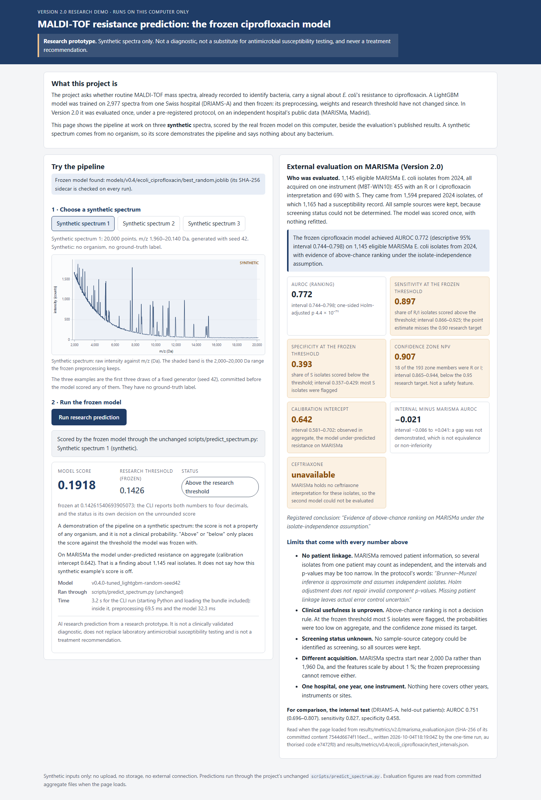

# Research demo: the frozen ciprofloxacin model

A local dashboard for showing what this research prototype does. It shows:
- three synthetic MALDI-TOF spectra;
- the frozen model scoring the selected spectrum on this computer;
- beside it, the published Version 2.0 evaluation on MARISMa, with its limits.

It follows [docs/research_demo_brief.md](../docs/research_demo_brief.md). It is not a clinical tool: no real spectra,
no labels, no antibiotic recommendation.



## Launch

**Prerequisites**
- This repository with its virtual environment, set up as in the main README (Python 3.11 or 3.12 and
  `pip install -r requirements.txt`). The demo adds no dependency: it uses FastAPI and uvicorn, which are already
  installed.
- The frozen model bundle `models/v0.4/ecoli_ciprofloxacin/best_random.joblib` and its `.sha256` sidecar. `models/`
  is not in Git; without the bundle the page still opens, but every prediction reports "The frozen model is not
  available".
- Any current browser on the same computer.

**Command** (Windows PowerShell, from the repository root):

```powershell
.\.venv\Scripts\python.exe -m demo
```

Then open **http://127.0.0.1:8050/**. Stop it with Ctrl+C.

**Options:**
- `--port 8051` serves another port.
- `--open` opens the browser for you.
- `--timeout 180` sets the seconds allowed per prediction.
- `--model PATH` passes another bundle to the CLI, which is useful for showing the error state.

The server binds to 127.0.0.1 and refuses any other host.

## A three-minute walkthrough

1. **Introduce the project** with the "What this project is" card:
   - a LightGBM model trained on 2,977 DRIAMS-A spectra, then frozen;
   - evaluated once on MARISMa under a pre-registered protocol.
2. **Pick "Synthetic spectrum 1".**
   - The plot shows the raw spectrum, with the 2,000–20,000 Da band the preprocessing keeps.
   - Say what it is: generated with seed 42, from no organism, with no ground-truth label.
3. **Press "Run research prediction".**
   - The spinner shows the real work: a fresh process runs `scripts/predict_spectrum.py`, unchanged, which loads and
     checksums the frozen bundle, preprocesses the spectrum and scores it. That takes about 2.5–3.5 s.
   - The card then shows the model score, the frozen threshold (0.1426) and whether the score is above or below it.
   - Read out the two cautions on the card:
     - a synthetic score describes no organism;
     - MARISMa's under-prediction is a finding about 1,145 real isolates, not a correction to this score.
4. **Switch to spectra 2 and 3** to show that each is scored the same way. All three happen to score above the
   threshold. They were fixed before any of them was scored, and that is not evidence about anything.
5. **Walk through the evaluation panel, top to bottom.**
   - **The registered sentence:** AUROC 0.772 (descriptive 95% interval 0.744–0.798), above-chance ranking under the
     isolate-independence assumption.
   - **Then, with equal weight, what fails:**
     - sensitivity 0.897 and specificity 0.393 at the frozen threshold;
     - under-prediction (calibration intercept 0.642);
     - the confidence zone's NPV of 0.907, with 18 R/I isolates among its 193 members, below the research target;
     - ceftriaxone unavailable.
   - **Close with the limits:** no patient linkage, clinical usefulness unproven, screening status unknown,
     different acquisition, and one hospital, one year and one instrument.

## How it works

```
browser ──HTTP on 127.0.0.1──► demo server (demo/app.py, FastAPI)
                                 ├─ GET /api/examples   three synthetic spectra (demo/synthetic.py, seed 42)
                                 ├─ GET /api/evidence   committed aggregates (demo/evidence.py)
                                 └─ POST /api/predict   {"example": id} ─► a temporary file ─► subprocess:
                                                          python scripts/predict_spectrum.py <file>   (unchanged)
                                                          ◄─ its JSON payload, from src.predict.prediction_payload
```

- **Why the CLI, not the API.** It is the simplest path that runs the real model unchanged. There is one server and
  no second port. The CLI prints exactly the payload the API returns, because both build it with
  `src.predict.prediction_payload`. The verification shows that the CLI, the API and an in-process call give
  identical scores for all three examples.
- **What the page receives.**
  - The server forwards an allow-list: score, threshold, above or below, model version, timings and the disclaimer.
  - The CLI's "Resistant" or "Susceptible" decision, and its confidence-zone label, never reach the page. The demo
    shows "above" or "below the research threshold" instead, from the CLI's own decision.
  - The payload rounds the score and threshold to four decimals. The page also names the exact frozen threshold,
    0.14261540693905073.
- **What is stored: nothing that survives the request.**
  - The selected synthetic spectrum is written to a temporary folder (`amr-demo-*`) for one CLI run, and deleted
    when it returns.
  - A server killed in the middle of a run could leave one such folder behind, holding only a synthetic spectrum.
    The next start removes any older than 15 minutes.
  - Responses are marked `Cache-Control: no-store`. The page uses no browser storage, and the server keeps no history.
  - The CLI writes no file and appends to no log; the project logger writes to the console only.
- **What is fetched from elsewhere: nothing.**
  - A Content-Security-Policy restricts the page to its own origin.
  - The server has no upload route, so only the three synthetic spectra can reach the model.

## Verification

- `python -m pytest -q tests/test_demo_synthetic.py tests/test_demo_app.py` runs in CI. The checks that need the
  frozen model are skipped there.
- `python scripts/demo_verify.py` runs end to end on a machine with `models/` and Microsoft Edge.
  - It starts the real server, the unchanged API and a headless Edge driven over the DevTools protocol.
  - It instruments every Python process with an audit hook, and the browser with its net log.
  - It writes [docs/demo/verification.md](../docs/demo/verification.md) and the screenshots in
    [docs/demo/screenshots/](../docs/demo/screenshots/).

## Limitations

- **Synthetic inputs only.** The scores demonstrate the pipeline and say nothing about any organism. The examples
  come from a simple generator, so they are probably unlike real spectra in ways that matter to the model, and their
  scores should not be read even as typical.
- **Each prediction starts a fresh process,** so a run takes a few seconds. That is the cost of using the unchanged
  CLI.
- **The demo serves this computer only.** There is no authentication, and it must not be exposed to a network.
- **The automated browser check needs Microsoft Edge on Windows.** The unit tests run everywhere.
