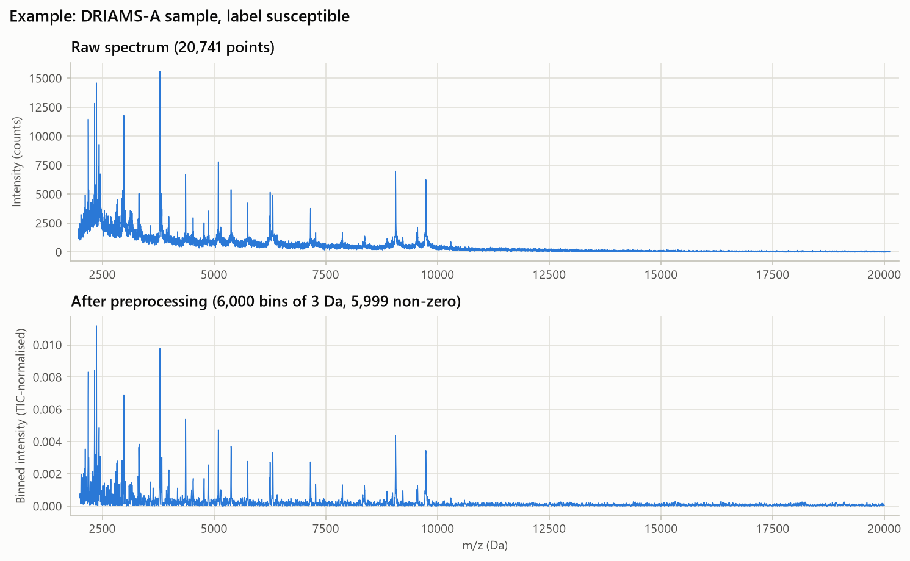
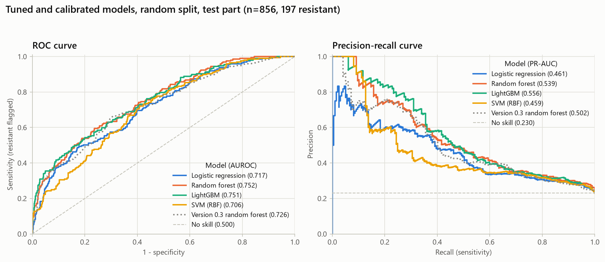
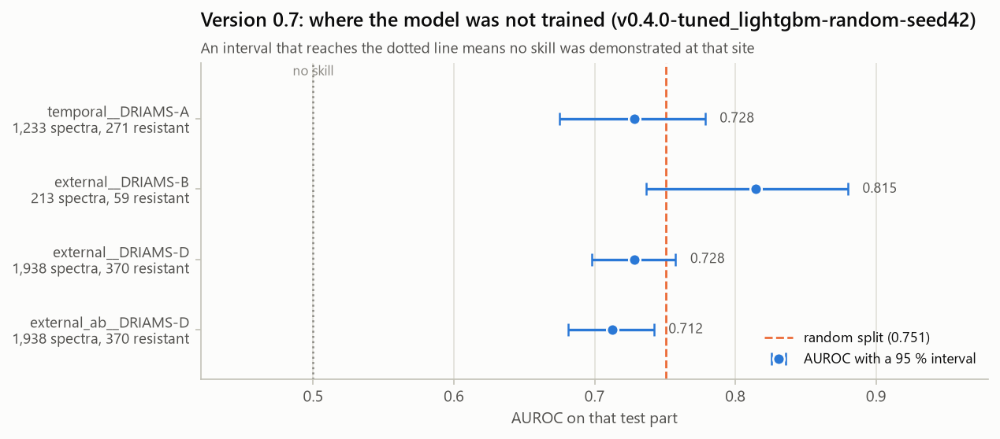
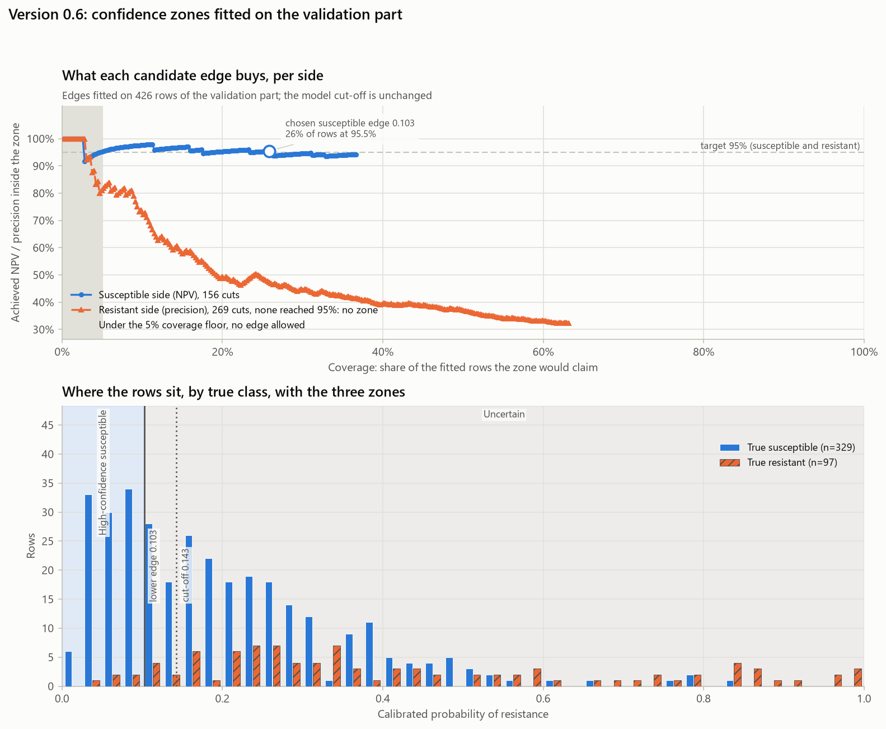
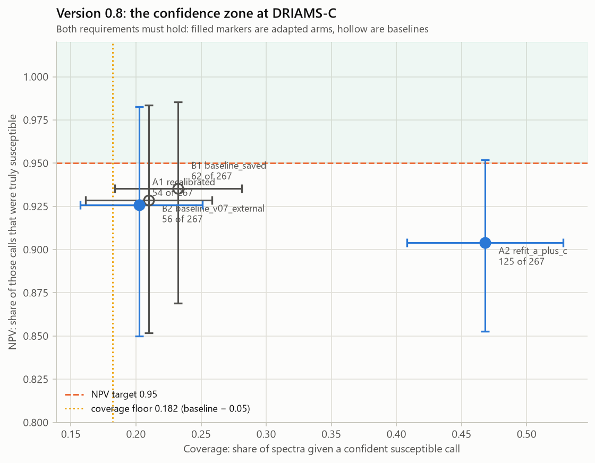
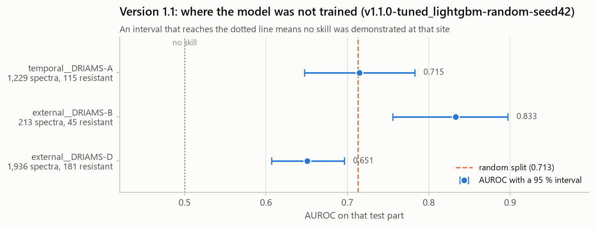

# Predicting antibiotic resistance from MALDI-TOF mass spectra: a pre-registered, versioned study on DRIAMS

*Thesis chapter draft, Versions 0.1–1.4*

**Author:** Moksh. **Affiliation:** [to be completed]. **Supervisor:** [to be completed]. **Draft of:** 2026-10-02.

**Source.** Release `v1.4.0` of the project repository (commit `bfcd903`). Every number in this chapter is copied from
the project's [research report](../research_report_v0.1-v1.4.md), which names the committed artifact behind each one.
[Appendix A](number_trace.md) traces every number in this chapter back to the report. Nothing was retrained, rescored
or regenerated to write it. Section and table numbers are local to this chapter, and can be renumbered to fit the
thesis.

> **Status.** The models described here are a research prototype. They are not a clinically validated diagnostic.
> Nothing in this chapter recommends a treatment or replaces antimicrobial susceptibility testing (AST).

## Summary

**Aim.** This chapter tests three things under pre-registered protocols, for *Escherichia coli* isolates in the
public DRIAMS database:
- whether machine-learning models can rank isolates by resistance from routine MALDI-TOF spectra;
- whether that performance holds across hospitals and over time;
- whether adaptation, cut-off rules or additional training data improve it.

**Methods.** Spectra were preprocessed statelessly, reproducing the published DRIAMS binned files, and split by
patient group.
- **Ciprofloxacin** (6,410 spectra from DRIAMS-A, -B and -D):
  - Baselines, tuned models and neural networks were compared on an internal test part, scored once.
  - The tuned LightGBM was then carried, unchanged, to a later year and to two external sites.
  - It was then adapted at a fourth site (DRIAMS-C).
- **Ceftriaxone** (6,489 spectra):
  - The method was repeated, again with test parts scored once.
  - Three development-only studies followed, on a derived pool of 2,421 spectra (247 resistant, from 105 resistant
    patients) whose labels had already been used.

**Results.**
- **Ciprofloxacin.**
  - The internal test AUROC was 0.751 [0.696, 0.807].
  - No generalisation gap was demonstrated at the later year or at either external site. The intervals were too wide
    to exclude gaps of practical size.
  - A confident-susceptible abstention zone reached NPV 0.948 on the stored test predictions. No confident-resistant
    zone existed, and at DRIAMS-C no arm's zone reached its 0.95 target on its point estimate.
  - Local recalibration was not demonstrated to help. Refitting on A + C improved the Brier score but lost the zone
    target (verdict "mixed").
- **Ceftriaxone.**
  - The test AUROC was 0.713 (0.604–0.818). That is above chance but not a usable decision rule: sensitivity was
    0.823 against a 0.90 research target, and specificity 0.422.
  - The development studies are exploratory. A cross-fitted cut-off brought no demonstrated benefit to probability
    quality.
  - An uncertainty-aware cut-off raised sensitivity only by flagging about 85 % of isolates.
  - Adding 495 screening isolates to training brought no demonstrated ranking gain (AUROC difference −0.007
    [−0.056, +0.043]).

**Conclusions.**
- Confirmatory evidence supports a modest ability to rank isolates for both antibiotics at DRIAMS-A.
- Most intervention studies did not demonstrate their primary endpoint. The one that did, V1.3's sensitivity gain,
  came at a specificity that failed its research objective.
- The research objectives were not met: a cut-off that holds 0.90 sensitivity on new data, a confident-resistant
  output, and demonstrated transfer.
- Model iteration on the ceftriaxone development pool stopped under a rule fixed before the last study.
- Further confirmation needs a hypothesis frozen before evaluation, on data that neither the exploration nor any
  earlier version has used.

## 1. Introduction

### 1.1 Motivation and scope

MALDI-TOF mass spectra are acquired routinely in clinical microbiology to identify bacterial species. Whether the
same spectra carry information about antibiotic resistance, and whether a model that learns it at one institution
keeps working elsewhere and later, are open methodological questions. This chapter studies them for one species,
*E. coli*, and two antibiotics, ciprofloxacin and ceftriaxone, using the public DRIAMS database.

The scope is methodological research:
- whether spectra carry resistance signal;
- how such models transfer between sites and over time;
- how their evaluation should be designed and reported.

It is not clinical diagnosis, choosing or ranking antibiotics for a patient, or replacing AST. The serving interface
built during the project (an HTTP API and a result page, Versions 0.9–1.0) demonstrates the frozen ciprofloxacin model
as an engineering exercise. It is not a validated tool.

### 1.2 Prior work

**DRIAMS.** Weis et al. [1] introduced DRIAMS, which combines more than 300,000 spectra and 750,000 resistance
phenotypes from four institutions. They reported AUROC 0.80, 0.74 and 0.74 for *S. aureus*, *E. coli* and
*K. pneumoniae*. The abstract does not say which antibiotic and classifier produced the *E. coli* 0.74, and the full
text could not be accessed. That attribution is therefore unverified, and this chapter does not use the figure as a
benchmark.

**Validation over time and place.** A later validation study [9] found that performance was poor when training and
test data were unrelated in location and time, and that it declined within 18 months after training. Both findings
motivate the generalisation questions below.

### 1.3 Research questions

| # | Question | Antibiotic | Versions |
|---|---|---|---|
| Q1 | How well do models rank new patients' isolates at the development hospital? | ciprofloxacin | 0.3–0.5 |
| Q2 | Does performance hold in a later year and at other sites? | ciprofloxacin | 0.7 |
| Q3 | Can the model abstain reliably (a confident-susceptible / uncertain output)? | ciprofloxacin | 0.6–0.8 |
| Q4 | Does local recalibration or refitting help at a new hospital? | ciprofloxacin | 0.8 |
| Q5 | Does the method carry to a second antibiotic? | ceftriaxone | 1.1 |
| Q6 | Can calibration, the cut-off rule or more training data improve the ceftriaxone model? (development only) | ceftriaxone | 1.2–1.4 |

### 1.4 Approach

The work was organised as a sequence of versions. Each version that evaluated anything was a **pre-registered study**,
with four safeguards:
- **Plans before code.** Its plan, covering the question, data, split, endpoint, comparator, interval method and what
  may be claimed, was written and committed before any code for it. It was then protected by a content hash that the
  test suite checks.
- **Dated amendments.** Changes to the evaluation protocol were recorded as dated amendments before the work they
  governed.
- **Test parts scored once.** Each test part was scored once per final model, and every scoring was appended to an
  append-only log.
- **Negative results kept.** They are reported with their intervals. "Not demonstrated" means the 95 % interval
  includes 0. It never means "equivalent" or "no effect".

The cycle ended under a stopping rule fixed before its last study (Section 7.3).

## 2. Data

### 2.1 Provenance

DRIAMS [2] holds spectra and AST results from four Swiss institutions, under a CC0 licence:

| Site | Institution | Period | Used here |
|---|---|---|---|
| DRIAMS-A | University Hospital Basel | 11/2015–08/2018 | development, internal tests, temporal test |
| DRIAMS-B | Canton Hospital Basel-Land | 01–06/2018 | external test; a training site in `external_ab` |
| DRIAMS-C | Canton Hospital Aarau | 01–08/2018 | Version 0.8 only (ciprofloxacin) |
| DRIAMS-D | Viollier AG, a diagnostic laboratory | 01–06/2018 | external test |

The A, B and D archives were verified against published checksums. C was downloaded in a browser from Dryad for
Version 0.8.

### 2.2 Label policy

- **Label 1 is R or I**, so intermediate results count as resistant. This was a project decision.
- **Label 0 is S.**
- **Excluded or missing.** Bracketed or mixed results, such as "R(1), S(1)", are ambiguous and excluded. "-" and
  empty cells are missing.
- **No breakpoint correction.** Labels are used as reported; breakpoint changes between 2015 and 2018 are not
  corrected.
- **Intermediate results** make up 64 of the 971 resistant ciprofloxacin labels at DRIAMS-A, and 1 of the 439
  resistant ceftriaxone labels.

A pre-specified sensitivity analysis that excludes them was not run (Section 8.4).

### 2.3 Cohorts, exclusions and missingness

| Cohort | Spectra (R) | A | B | D |
|---|---|---|---|---|
| `ecoli_ciprofloxacin` | 6,410 (1,400) | 4,259 (971) | 213 (59) | 1,938 (370) |
| `ecoli_ciprofloxacin__site-C` (V0.8) | 889 (191) | – | – | – |
| `ecoli_ceftriaxone` | 6,489 (681) | 4,283 (439) | 213 (45) | 1,993 (197) |
| `ecoli_ceftriaxone_with_screening` (V1.4, training rows only) | 7,138 (1,316) | 4,932 | 213 | 1,993 |

The `__site-C` cohort contains DRIAMS-C spectra only.

**Exclusions at DRIAMS-A**, by first applicable reason:

| Reason | Ciprofloxacin | Ceftriaxone |
|---|---|---|
| no result | 2,334 | 2,332 |
| ambiguous result | 75 | 27 |
| HospitalHygiene workstation | 633 | 659 |
| malformed file | 8 | 8 |
| raw file disagrees with the published binned file | 11 | 11 |

**Missingness is informative about sample type, not ignorable.** For ceftriaxone at DRIAMS-A, 32 % of *E. coli* rows
have no result. The share depends strongly on the workstation:

| Workstation | Share with no result |
|---|---|
| urine | 10 % |
| blood | 14 % |
| deep tissue | 26 % |
| respiratory | 32 % |
| genital | 93 % |
| stool | 99 % |

Every cohort is therefore "isolates the laboratory tested and reported", dominated by urine, blood and deep tissue.

**Screening isolates.** HospitalHygiene samples (colonisation screening) were excluded from every evaluated cohort
from Version 0.2 onwards. Version 0.1's exploration had found them 78 % ciprofloxacin-resistant, against 20–32 % for
clinical sample types, and flagged them as a possible shortcut. Of 659 such ceftriaxone results at A, 645 are
resistant. Version 1.4 used them as training data only (Section 5.6).

**Ceftriaxone cohort selection.** The ceftriaxone cohort consists of isolates with both a ciprofloxacin and a
ceftriaxone result, because its splits derive from the ciprofloxacin cohort.
- 93 ceftriaxone-only isolates (27 resistant: 29.0 % against 10.2 %) fall in no split.
- On this cohort the pair does not meet the pre-registered selection rule: 428 resistant at A, against a required 500.
- It looked eligible in Version 0.1 (1,086 class-1 rows) only because that metadata-level count included the
  screening isolates.

### 2.4 Patient linkage limits

- **Within-year grouping at A.** DRIAMS-A re-hashes `patient_no` every year, so patients can be grouped within a year
  folder only.
  - A patient who returns in another year cannot be detected.
  - Random splits and the temporal split may therefore place one person on both sides. The temporal result is a
    date-separated evaluation with incomplete patient linkage.
- **No identifiers at B, C and D.** These sites carry no patient identifiers, so each spectrum is its own group. Their
  intervals are sample-level, with unknown dependence within a patient, and are expected to be too narrow.
- **Repeat spectra are common.**
  - 76 % of DRIAMS-A *E. coli* ciprofloxacin spectra come from patients with more than one spectrum in the same year.
  - In the ceftriaxone development pool, 247 resistant spectra come from 105 resistant patients.
  - The 11 patients (10 %) with the most resistant spectra contribute 27 % of them.

## 3. Methods

### 3.1 Preprocessing and features

Spectra were processed in this order:
1. square-root transformation of intensities;
2. Savitzky–Golay smoothing;
3. SNIP baseline removal (20, then 100, iterations);
4. total-ion-current normalisation;
5. trimming to 2,000–20,000 Da and binning into 3 Da bins, giving 6,000 features.

This reproduces the DRIAMS preprocessing, which uses MALDIquant algorithms [10], to within 5.9 × 10⁻⁸ relative
difference from the published binned files.

Preprocessing is stateless. Every learned step (scaling, PCA, feature selection) sits inside a model pipeline fitted
on training rows only.

*Figure 1. One DRIAMS-A spectrum (label susceptible): the raw spectrum (top), and the same spectrum after
preprocessing into 6,000 bins of 3 Da (bottom).*

### 3.2 Models

- **Version 0.3** compared logistic regression, a random forest and LightGBM as baselines.
- **Version 0.4** tuned and calibrated logistic regression, a random forest, LightGBM and an RBF support-vector
  machine. Selection was on validation data, and the tuned LightGBM was saved as the served model.
- **Version 0.5** compared a multilayer perceptron and a one-dimensional convolutional network against it.
- **Later versions** reused the Version 0.4 setting unless their plan said otherwise. They either refitted it per
  split, or carried the saved model unchanged.

### 3.3 Evaluation rules

The evaluation protocol was approved on 2026-09-17 and amended eleven times. Each amendment was recorded before the
work it governed.

- **Metrics:** AUROC is primary and PR-AUC co-primary.
- **Cut-off:** the highest threshold whose validation sensitivity is at least 0.90.
- **Intervals:**
  - 95 % percentile intervals, from 2,000 bootstrap resamples of whole patient groups (seed 42);
  - a paired bootstrap for two models on the same rows;
  - an unpaired second-level bootstrap for different test sets.
- **Comparisons:** a model is called better only if the interval of the difference excludes 0.
- **Scoring:** each test part is scored once per final model, and every scoring is appended to an append-only log
  (113 rows).

**Every operating number is a research criterion, not a clinical standard.** That covers:
- the 0.90 sensitivity target;
- the 0.95 zone and tolerance levels;
- the 0.20 "flags nearly everyone" line;
- the 7-day label gap;
- the support minimums.

### 3.4 Pre-registration and record-keeping

- **Plans are locked.** Each study's plan is a committed document (`docs/v*_plan.md`). Its locked text is pinned in
  `tests/test_preregistration.py` by length and SHA-256, so any later change to a locked plan fails the test suite.
- **Results are only appended.**
  - Confirmatory scorings go to the production log (113 rows).
  - Development-only studies (Versions 1.2–1.4) write to a separate development log (34 rows), which cannot be
    mistaken for it.
  - A test-session guard fails any test run that changes either log.
- **Commits are archived.** Commits cited by the records are kept by annotated `research-archive/…` tags. Because the
  versions reached the main branch by squash merges, most cited commits resolve only through these tags.

### 3.5 The studies

| ID | Version, date | Question | Data and split | Status |
|---|---|---|---|---|
| E0.1 | 0.1, 2026-09-17 | pair selection | A/B/D metadata | descriptive |
| E0.2 | 0.2, 2026-09-17 | cohort, splits | 6,410 cipro spectra | descriptive |
| E0.3 | 0.3, 2026-09-17 | baselines | cipro `random`, `within_year` tests | confirmatory |
| E0.4 | 0.4, 2026-09-18 | tuning + calibration | cipro `random` test | confirmatory |
| E0.5 | 0.5, 2026-09-18 | neural networks | cipro `random` test | confirmatory |
| E0.6 | 0.6, 2026-09-20 | explanations, zones | cipro validation; stored test predictions | descriptive / derived |
| E0.7 | 0.7, 2026-09-23/24 | generalisation | cipro `temporal`, `external`, `external_ab` | confirmatory |
| E0.8 | 0.8, 2026-09-24 | adaptation at C | cipro C protected 30 % | confirmatory |
| – | 0.9–1.0, 2026-09-25/28 | API, result page | none | engineering |
| E1.1 | 1.1, 2026-09-30 | second antibiotic | ceftriaxone test parts | confirmatory |
| E1.2 | 1.2, 2026-09-30 | calibration, cut-off | ceftriaxone dev pool, 5-fold × 3 | exploratory |
| E1.3 | 1.3, 2026-09-30 | cut-off rules over time | dev pool, 2017 origins | exploratory |
| E1.4a | 1.4, 2026-09-30 | discrimination audit | dev pool, metadata, saved outputs | descriptive |
| E1.4b | 1.4, 2026-10-01 | screening isolates as training data | dev pool + 495 screening spectra | exploratory |

The commits that pre-registered, ran and recorded each study are listed in the report's Table 1 and in the
[evidence map](../evidence_map.md).

## 4. Results: ciprofloxacin

All ciprofloxacin results come from test parts scored once, and are confirmatory under the protocol unless marked
otherwise.

### 4.1 Q1: ranking at the development hospital

The served model is the tuned LightGBM of Version 0.4. It was evaluated on 856 held-out spectra (197 resistant):

| Measure | Value |
|---|---|
| AUROC | 0.751 [0.696, 0.807] |
| PR-AUC | 0.556 [0.445, 0.659], against a no-skill 0.230 |
| Brier score | 0.144 [0.120, 0.170] |
| Sensitivity at its validation cut-off | 0.827 [0.760, 0.896], against the 0.90 target |
| Specificity at that cut-off | 0.458 [0.411, 0.505] |

**Comparisons with other models:**
- **Version 0.3 random forest** (0.726): the improvement over it was +0.025 [−0.012, +0.060], not demonstrated.
- **Version 0.5 MLP:** scored 0.712 (MLP − V0.4: −0.039 [−0.085, +0.005]).
- **Version 0.5 1-D CNN:** scored 0.498 [0.440, 0.559].

**Patient overlap.** The size-matched `random` minus `within_year` difference was −0.006 [−0.117, +0.104], which is
uninformative.

*Figure 2. ROC (left) and precision–recall (right) curves of the Version 0.4 tuned and calibrated models on the
ciprofloxacin `random` test part (856 spectra, 197 resistant), with the Version 0.3 random forest for reference. The
served model (LightGBM) was chosen on validation data, not on these test curves.*

### 4.2 Q2: a later year and other sites (Version 0.7)

The setting was refitted per split. AUROC on each test part, and its gap from the internal (random-split) result:

| Test part | Spectra / resistant | AUROC | Gap: random minus this part |
|---|---|---|---|
| DRIAMS-A, 2018 | 1,233 / 271 | 0.728 | +0.022 [−0.054, +0.094] |
| DRIAMS-B | 213 / 59 | 0.815 | −0.064 [−0.152, +0.030] |
| DRIAMS-D | 1,938 / 370 | 0.728 | +0.023 [−0.043, +0.085] |

**No gap was demonstrated, and none was excluded.** The intervals are 0.13–0.18 wide.

Adding DRIAMS-B to training changed AUROC at DRIAMS-D by −0.016 [−0.034, +0.001].

*Figure 3. Version 0.7: AUROC with 95 % intervals on the later year at DRIAMS-A, at DRIAMS-B and at DRIAMS-D, and at
DRIAMS-D after training on A + B. The dashed line marks the internal random-split AUROC.*

### 4.3 Q3: abstention

**The confident-susceptible zone.**
- **On validation:** probabilities below 0.1026 formed a confident-susceptible zone, with NPV 0.955 at 25.8 %
  coverage.
- **On the stored test predictions:** it reached NPV 0.948 [0.910, 0.981] at 24.9 % coverage. This is derived from
  saved predictions, not a new scoring.

**No confident-resistant zone exists.** The best achievable precision was 0.84, at 5.9 % coverage. Every
high-probability spectrum is therefore reported as "uncertain".

*Figure 4. Version 0.6 confidence zones, fitted on the ciprofloxacin validation part.*
- *Top: the NPV (susceptible side) and precision (resistant side) achievable at each coverage. Only the susceptible
  side reached the 95 % target.*
- *Bottom: calibrated probabilities by true class, with the confident-susceptible zone and the model cut-off.*

**Transfer of the zone, carried unchanged.** Version 0.7's pre-registered transfer criterion was NPV ≥ 0.95, or an
interval covering 0.95.

| Where | Result | Reading |
|---|---|---|
| DRIAMS-D | NPV 0.963 [0.939, 0.983] (saved model) | met the criterion |
| DRIAMS-B | 0.922 on 51 covered spectra | could not be judged; not rejected only because its interval covers 0.95 |
| 2018 | 0.893 [0.844, 0.937] | fell short, but on a refitted, recalibrated model. The saved model shares 848 of those 1,233 spectra, so this is not a clean test of the zone. |

**At DRIAMS-C** Version 0.8 used a stricter criterion: a point estimate ≥ 0.95, with a coverage floor.
- No arm met it: NPV 0.935 (saved model), 0.929, 0.926 and 0.904.
- The saved model's interval there (0.869–0.985) covers 0.95, so under Version 0.7's criterion it would not have been
  rejected.

The two versions judged the zone differently, and neither result establishes that it holds or that it fails.

### 4.4 Q4: adaptation at a new hospital (Version 0.8)

The evaluation used 267 spectra, 71 of them resistant.

| Arm | Brier | AUROC | Brier(saved model) minus Brier(arm) | Holm p | Verdict |
|---|---|---|---|---|---|
| B1 saved model | 0.1458 | 0.765 | – | – | baseline |
| A1 recalibration only | 0.1493 | 0.765 | −0.0035 [−0.0161, +0.0085] | 0.576 | not demonstrated |
| A2 refit on A + C | 0.1271 | 0.820 | +0.0187 [+0.0086, +0.0290] | 0.001 | **mixed** (zone NPV 0.904 < 0.95) |

*Figure 5. Version 0.8: NPV against coverage of the confident-susceptible zone at DRIAMS-C, for the baselines
(hollow markers) and the adapted arms (filled), with the 0.95 NPV target and the coverage floor. No arm's point
estimate reached the target.*

## 5. Results: ceftriaxone

### 5.1 Q5: the method on a second antibiotic (Version 1.1, confirmatory)

The `random` test part has 856 spectra, 79 of them resistant. These spectra had been scored before for
ciprofloxacin; their ceftriaxone labels were unused.

**Arm T:**
- **Ranking:** AUROC **0.713 (0.604–0.818)**, above chance by the plan's rule. PR-AUC was 0.214, against a no-skill
  0.092.
- **Probabilities:** Brier score 0.083, against 0.084 for predicting the base rate.
- **At the cut-off**, set on 34 resistant validation spectra: sensitivity 0.823, specificity 0.422 and precision
  0.127.

**Retuning versus reusing the ciprofloxacin setting** (T − F): +0.009 [−0.021, +0.034].

**Gaps** (all not demonstrated):

| Test part | Gap |
|---|---|
| 2018 | −0.002 [−0.131, +0.125] |
| DRIAMS-B | −0.120 [−0.249, +0.008] |
| DRIAMS-D | +0.062 [−0.054, +0.177]; the weakest site (0.651, 0.607–0.696) |

*Figure 6. Version 1.1 (ceftriaxone): AUROC with 95 % intervals on the later year at DRIAMS-A, at DRIAMS-B and at
DRIAMS-D. The dashed line marks the internal random-split AUROC.*

### 5.2 The development pool (Versions 1.2–1.4, exploratory)

After Version 1.1, no untouched evaluation data remained in the A, B and D cohorts.

**The pool** holds the `random` training and validation rows that were never in a spent test part and share no
patient group with one: 2,421 spectra, of which 247 are resistant, from 1,189 patient groups (105 resistant).

**Its labels were reused.** They trained Version 1.1's arm T and were used again by every later study. **No result in
Sections 5.3–5.6 is independent evidence**, and additional folds, seeds or resplits of the pool cannot make it so.

### 5.3 Calibration and cut-off stability (Version 1.2)

Arm B is the Version 1.1 procedure. Arm C uses a cross-fitted cut-off on the whole training fold.

- **Primary endpoint, Brier(B) − Brier(C):** +0.0002 [−0.0024, +0.0028], not demonstrated. Partitions 43 and 44 gave
  −0.0002 and +0.0006.
- **Stability:** C's delivered sensitivity varied less across the 15 folds (SD 0.058 against 0.151), at lower
  specificity (0.370 against 0.446).
- **Target reached:** both arms reached 0.90 in 7 of 15 folds.
- **Forward in time:** fitted before 2017 and applied to 2017, no arm held its target (delivered sensitivity
  0.556–0.789).

### 5.4 Cut-off rules over time (Version 1.3)

Rule U, an order-statistic tolerance rule [3], was compared with rule E, the protocol's rule, at two 2017 origins.

- **Sensitivity:** pooled, 0.929 against 0.814 (U − E +0.115 [+0.019, +0.248]).
- **Specificity:** U's was 0.160 (0.085–0.393), and it flagged 85 % of isolates.

Under the pre-set order the verdict was "unhelpful". The 0.56 / 0.44 chances that rule E attains 0.90 are theoretical
binomial values under exchangeability, not observed rates.

### 5.5 Discrimination audit

The audit checked labels, preprocessing, fitted transformations, grouping, class weights and calibration. No verified
defect affected a historical conclusion.

- Pooled AUROC equalled AUROC within half-years and within sample types, to ±0.005.
- Class weighting did not change cross-validated AUROC in the saved searches (0.771 against 0.773).

**The verified constraint was the number of resistant patients.**

### 5.6 Screening isolates as training data (Version 1.4)

495 screening spectra (233 new patients) were added to training only.

**Primary endpoint.** AUROC on held-out clinical spectra, A1 − A0: **−0.007 [−0.056, +0.043], not demonstrated.**
Every partition's mean was negative.

**Secondaries** (unadjusted):
- PR-AUC was lower with A1 in all three partitions.
- At equal sensitivity (0.895), A1's specificity was higher: +0.026 [+0.004, +0.049].
- With one spectrum per patient: −0.026 [−0.071, +0.018].
- Forward in time: +0.001 [−0.046, +0.049].

**Source separability.** Resistant screening and clinical spectra were separable, with AUROC 0.937 (0.912–0.959).

The 495 are what remained of 659 HospitalHygiene results:
- 145 dated 2018 or later were dropped, because nothing from the spent temporal period is used.
- 9 were dropped because the patient has a clinical spectrum outside the pool.
- 10 failed the builder's checks: 3 were unreadable, and 7 disagreed with the published binned file.

## 6. Synthesis

### 6.1 Principal results and their uncertainty

| Result | Antibiotic | n / resistant | Estimate [95 % interval] | Interval | Status |
|---|---|---|---|---|---|
| Served model, internal AUROC | cipro | 856 / 197 | 0.751 [0.696, 0.807] | group bootstrap | confirmatory |
| V0.4 − V0.3, AUROC | cipro | 856 / 197 | +0.025 [−0.012, +0.060] | paired | not demonstrated |
| Sensitivity at cut-off (target 0.90) | cipro | 197 R | 0.827 [0.760, 0.896] | group bootstrap | confirmatory |
| Gap, random − 2018 | cipro | 1,233 / 271 | +0.022 [−0.054, +0.094] | unpaired 2nd-level | not demonstrated |
| Gap, random − DRIAMS-D | cipro | 1,938 / 370 | +0.023 [−0.043, +0.085] | unpaired, sample-level | not demonstrated |
| Confident-susceptible NPV (stored test) | cipro | 213 covered | 0.948 [0.910, 0.981] | group bootstrap | derived |
| Recalibration at C, Brier(B1) − Brier(A1) | cipro | 267 / 71 | −0.0035 [−0.0161, +0.0085] | paired, Holm | not demonstrated |
| Refit A + C, Brier(B1) − Brier(A2) | cipro | 267 / 71 | +0.0187 [+0.0086, +0.0290] | paired, Holm | mixed |
| Arm T, internal AUROC | ceftriaxone | 856 / 79 | 0.713 (0.604–0.818) | group bootstrap | confirmatory |
| T − F, AUROC | ceftriaxone | 856 / 79 | +0.009 [−0.021, +0.034] | paired | not demonstrated |
| Gap, random − DRIAMS-D | ceftriaxone | 1,936 / 181 | +0.062 [−0.054, +0.177] | unpaired, sample-level | not demonstrated |
| V1.2 Brier(B) − Brier(C) | ceftriaxone | 2,421 / 247 | +0.0002 [−0.0024, +0.0028] | group bootstrap, fits fixed | exploratory |
| V1.3 U − E, pooled sensitivity | ceftriaxone | 1,453 / 156 | +0.115 [+0.019, +0.248] | two-level bootstrap, fits fixed | exploratory |
| V1.4 A1 − A0, AUROC (15 folds) | ceftriaxone | 2,421 / 247 | −0.007 [−0.056, +0.043] | corrected repeated CV (Section 8.5) | exploratory |

### 6.2 What each intervention study showed, by kind of endpoint

The exploratory secondaries column lists intervals that excluded 0. They are unadjusted, and they are not claims.

| Study | Primary endpoint (pre-registered) | Confirmatory secondary | Exploratory secondaries | Research objective |
|---|---|---|---|---|
| V0.4 tuning (cipro) | AUROC vs V0.3: +0.025 [−0.012, +0.060], not demonstrated | – | – | better ranking: not shown |
| V0.5 networks (cipro) | MLP − V0.4: −0.039 [−0.085, +0.005], not demonstrated; CNN − V0.4: −0.253 [−0.324, −0.177] (worse) | – | – | not met |
| V0.7 second training site (cipro) | A + B vs A at D: −0.016 [−0.034, +0.001], not demonstrated | – | – | not shown |
| V0.8 adaptation at C (cipro) | recalibration, Brier(B1) − Brier(A1): −0.0035 [−0.0161, +0.0085], not demonstrated | **refit A + C, Brier(B1) − Brier(A2): +0.0187 [+0.0086, +0.0290], Holm p 0.001 — improved**; verdict "mixed" because the zone reached NPV 0.904 < 0.95 | – | adaptation with a trustworthy zone: not met |
| V1.1 retuning (ceftriaxone) | T − F AUROC: +0.009 [−0.021, +0.034], not demonstrated | – | favouring F (reused setting): PR-AUC T − F −0.040 [−0.091, −0.004]; Brier T − F +0.0028 [+0.000002, +0.0059] | retuning needed: not shown |
| V1.2 cross-fitted cut-off (ceftriaxone, dev) | Brier(B) − Brier(C): +0.0002 [−0.0024, +0.0028], not demonstrated | – | Brier(B) − Brier(D1): +0.0020 [+0.0002, +0.0036] (fitting on 8/8 vs 7/8 of a fold); C's sensitivity steadier (SD 0.058 vs 0.151, descriptive) | better probabilities: not shown |
| V1.3 uncertainty-aware cut-off (ceftriaxone, dev) | **U − E pooled sensitivity: +0.115 [+0.019, +0.248] — met** | – | – | **not met**: U's specificity 0.160 (flags 85 %), "unhelpful" under the pre-set order |
| V1.4 screening isolates (ceftriaxone, dev) | A1 − A0 AUROC: −0.007 [−0.056, +0.043], not demonstrated | – | A1 − A0 specificity +0.026 [+0.004, +0.049] at equal sensitivity, alongside lower PR-AUC | better ranking: not shown |

"Not demonstrated" means the interval includes 0. It is never "equivalent" or "no effect".

### 6.3 Negative findings and unmet objectives

1. Tuning (V0.4) did not demonstrably beat the Version 0.3 baseline. Neural networks (V0.5) did not beat tuning, and
   the 1-D CNN was at chance.
2. The 0.90 sensitivity cut-off, chosen on a validation part, missed its target on test for both antibiotics (0.827
   and 0.823). In development checks it fell short on average:
   - V1.2's cross-fitted arm averaged 0.892 over 15 folds, 7 of which reached 0.90;
   - the V1.2 forward split gave 0.556–0.789;
   - V1.3's periods gave 0.794 and 0.830.
3. No confident-resistant zone could be formed. The confident-susceptible zone reached its target on the stored test
   predictions from the development hospital and at DRIAMS-D. It did not reach it in 2018 (on a refitted model), or at
   DRIAMS-C on its point estimate.
4. Local recalibration at DRIAMS-C was not demonstrated to help. The refit improved the probabilities but lost the zone.
5. Adding a second training site did not demonstrably help at a third.
6. Retuning for ceftriaxone did not demonstrably beat reusing the ciprofloxacin setting.
7. A cross-fitted cut-off did not demonstrably improve probability quality (V1.2).
8. An uncertainty-aware cut-off raised sensitivity only by flagging nearly everyone (V1.3).
9. Intercept recalibration on recent data was not demonstrated to help (V1.3).
10. More resistant training data, from screening isolates, did not demonstrably improve ranking (V1.4).

## 7. Discussion

### 7.1 What the evidence supports

| Claim | Status | Basis |
|---|---|---|
| Spectra carry some ciprofloxacin resistance signal at DRIAMS-A (ranking better than chance) | **supported** | E0.4, AUROC 0.751 [0.696, 0.807], confirmatory |
| Spectra carry some ceftriaxone resistance signal at DRIAMS-A | **supported** | E1.1, 0.713 (0.604–0.818), confirmatory |
| The 0.90-sensitivity cut-off delivers 0.90 on new data | **unsupported** | missed on test for both antibiotics and in development checks |
| The models are usable decision rules | **unsupported** | specificity 0.42–0.46 at the cut-off; no justified operating requirement |
| A confident-susceptible zone is reliable at the development hospital | supported on stored test predictions (derived) | E0.6 |
| The zone transfers to other sites and times | **unresolved** | met at D; uninformative at B; fell short in 2018 on a refitted model; not met at C on its point estimate (interval covers 0.95) |
| Performance generalises to other sites / later time (no gap) | **unresolved** | no gap demonstrated, none excluded |
| Ciprofloxacin results are robust to counting I as resistant | **unresolved** | pre-specified analysis never run (Section 8.4) |
| Local recalibration helps at a new hospital | **unresolved** (not demonstrated) | E0.8 |
| Refitting on the new site improves probability quality | supported for Brier at C, with the zone lost | E0.8, mixed |
| Retuning is needed per antibiotic | **unresolved** | E1.1 T − F not demonstrated |
| A cross-fitted cut-off gives more stable sensitivity | exploratory description only | E1.2 |
| An uncertainty-aware cut-off gives useful performance | **unsupported** | E1.3 |
| Screening isolates improve ranking of clinical isolates | **unresolved** (not demonstrated) | E1.4b |
| The limit is discrimination / a biological ceiling | **unsupported** | never tested; withdrawn wording |
| Screening–clinical separability is caused by culture medium | **unsupported** | cause untested |
| Anything about clinical benefit, treatment or other species | **unsupported** | out of scope |

The confirmatory evidence is narrow. Spectra from one hospital support modest ranking for both antibiotics: AUROC
about 0.71–0.75, at a single site. At the cut-off the protocol fixed, the models are not usable decision rules.
Specificity was 0.42–0.46, and no operating requirement was ever justified externally.

### 7.2 Reading null results and separability

**A null result is not equivalence.** Failing to demonstrate an improvement does not establish equivalence. Nor does
it establish a biological ceiling on what spectra can reveal about ceftriaxone resistance. The audit's "biological
ceiling" is recorded as an untested hypothesis. Every interval in Section 6 that includes 0 also admits effects that
were not excluded.

**Separability does not show cause.** Resistant screening spectra were separable from resistant clinical spectra
(AUROC 0.937), but that does not establish why. Candidate causes include culture medium, strain lineage mix, patient
population, acquisition time and instrument state; none was tested. Culture medium measurably changes MALDI-TOF
spectra in other taxa [7, 8], which makes it a plausible candidate here but not an established one.

**How precise the comparisons were.** No adequate power analysis exists for any comparison in this project. The
studies produced intervals of these widths:
- V1.4's primary AUROC difference: −0.056 to +0.043;
- its partition-42 bootstrap interval: −0.038 to +0.024;
- V1.2's C − B AUROC: −0.032 to +0.006;
- V1.1's T − F AUROC: −0.021 to +0.034;
- the ciprofloxacin generalisation gaps: 0.13–0.18 wide.

Differences smaller than these widths could not be distinguished from zero in these designs.

### 7.3 Why model iteration stopped

The stop follows the bounded plan, not a judgement that nothing more could be learned. Before any code, Version 1.4's
plan fixed that it would be the last model-iteration study on the ceftriaxone development pool, whatever it found.
Two further reasons support honouring that:
- The pool's labels had informed four versions. Another result on them would add little independent evidence, and
  would increase the risk of fitting the analysis to the data.
- The one data lever the audit found was tested, and its benefit was not demonstrated.

Further analysis of these data could still be informative, for example as descriptive work, or as pre-registered
hypotheses evaluated on new data. It cannot provide confirmation.

### 7.4 Relation to prior work

The published DRIAMS figures [1] are not used as a reference point here, because the antibiotic and classifier behind
the *E. coli* figure are unverified (Section 1.2).

A later validation study [9] found poor performance when training and test data were unrelated in location and time.
This chapter neither confirms nor contradicts that finding. No generalisation gap was demonstrated here, but the
intervals were too wide to exclude gaps of practical size.

## 8. Threats to validity and reporting integrity

### 8.1 Threats to validity

- **Reuse of evaluation data.**
  - The ciprofloxacin `random` test part was scored for three successive versions' models. The protocol forbade
    choosing on test, but repeated looks weaken the independence of later comparisons.
  - The ceftriaxone development pool was reused by four versions.
- **Patient linkage.** Recurrence across years at A cannot be detected, and B, C and D have no patient IDs.
- **Small numbers of resistant isolates** in decisive parts:
  - 34 resistant validation spectra set the ceftriaxone cut-off;
  - 51 covered spectra judged the zone at B;
  - 71 resistant spectra decided V0.8;
  - 105 resistant patients underlie every ceftriaxone development result.
- **Cohort selection.**
  - Only isolates with a reported result are included, and that share depends strongly on sample type.
  - For ceftriaxone, only isolates that also had a ciprofloxacin result are included.
  - Screening isolates were excluded.
- **Label and time effects.** Breakpoints and laboratory practice over 2015–2018 are uncorrected. Resistance
  prevalence and the sample-type mix drifted within the development period.
- **A single hospital for development**, and three external institutions with small or sample-level evaluations.
- **Estimation choices.**
  - Bootstrap intervals hold fitted models fixed unless stated, and the V1.4 interval is approximate (Section 8.5).
  - Results for random forests, LightGBM and networks depend on seeds.
- **Researcher degrees of freedom.** Versions 1.2–1.4 were motivated by earlier results on the same data. Their plans
  were recorded before their code and runs, but were not reviewed by the owner before recording.
- **Engineering claims**, such as latency and API behaviour, come from one laptop and are not performance evidence.

### 8.2 Data exposure

| Data | Antibiotic | Used for | Times scored / status |
|---|---|---|---|
| A `random` test part (856) | cipro | V0.3, V0.4, V0.5 final models | once per final model; **spent** |
| A `within_year` test part (366) | cipro | V0.3, V0.4 | **spent** |
| A `temporal` test part (2018) | cipro | V0.7 | once; **spent** |
| B, D `external` test parts | cipro | V0.7 (incl. saved model at B, D) | once; **spent** |
| D `external_ab` test part | cipro | V0.7 | once; **spent** |
| C protected 30 % (267) | cipro | V0.8 | once; **spent** |
| C adaptation 70 % (622) | cipro | V0.8 A1/A2 fitting | used for fitting |
| A `random` test part (856) | ceftriaxone | V1.1 | once; **spent** |
| A 2018, B, D test parts | ceftriaxone | V1.1 generalisation | once; **spent** |
| Development pool (2,421) | ceftriaxone | V1.1 training/validation; V1.2–V1.4 | reused repeatedly; exploratory only |
| A screening isolates < 2018 (495 used) | ceftriaxone | V1.4 training only | aggregate labels read in the audit |
| A screening isolates dated 2018 (145) | ceftriaxone | none | unused |
| DRIAMS-C ceftriaxone labels | ceftriaxone | none by any model | **status uncertain**: aggregate counts were viewed on 2026-09-30; opening them requires an owner-approved amendment |

**No untouched, independent evaluation data remain for either antibiotic in DRIAMS-A, -B or -D.**

### 8.3 Reporting corrections made without rerunning anything

A final review corrected the project's own reporting and recorded each correction in the research report (its
Section 8.1). The main ones:
- **The cut-off.** It is the **highest** threshold reaching validation sensitivity 0.90, not the smallest.
- **DRIAMS-D** is a diagnostic laboratory, not a hospital.
- **Training sites.** The served model never trained on B, C or D. Version 0.7's `external_ab` did train on A + B,
  and Version 0.8's arm A2 on A + C.
- **Clinical wording.** Phrases implying clinical relevance were reworded, because no clinical threshold was ever
  justified.
- **The zone at DRIAMS-B** is "not rejected, uninformative", not "held".
- **The published 0.74 AUROC.** Its attribution to ceftriaxone is unverified.
- **The "detectable with 80 % power" figure** once quoted for Version 1.4 was withdrawn. It had been extrapolated from
  another comparison's fold noise.

### 8.4 Pre-specified analyses that were not executed

- **Headline metrics with intermediate (I) results excluded.**
  - The dataset was built (6,345 spectra, same partition), but no model was ever evaluated on it.
  - The effect on the ciprofloxacin results of counting I as resistant is therefore **not known**. I is 64 of 971
    resistant labels at A.
  - For ceftriaxone the question hardly arises, with 1 I label.
- **Hospital-hygiene samples as a separate test set.** This item was optional, and was not done. Version 1.4 used
  those samples differently, as training data only.
- **DRIAMS-C as a further external site.** Covered in substance by Version 0.8's baseline arm B1, the saved model on
  C's protected part (AUROC 0.765, Brier 0.1458).

### 8.5 How the Version 1.4 interval treats fitting variability

The 15 AUROC differences, one per fold, come from 3 repetitions of 5-fold cross-validation of **the same 2,421
spectra**. They are not 15 independent cohorts, and a naive t-interval would be too narrow.

**The correction.** The plan used the corrected repeated k-fold cv test [4], which applies the correction of
Nadeau and Bengio [5]:
- variance (1/15 + 1/4)·s²;
- a t distribution with 14 degrees of freedom.

This inflates the variance about 4.75-fold over the naive estimate.

**Its limits:**
- **Which variability.** It reflects, approximately, which patients land in the training and test folds. The model
  seed was fixed (42) in both arms, so seed variability is excluded.
- **A heuristic.** No universally unbiased estimator of the variance of K-fold cross-validation exists [6].
- **An extrapolation.** Its use for AUROC per fold, with 3 × 5 folds, goes beyond the setting it was studied in.

Each of these qualifications could only widen the interval. The verdict "not demonstrated" is therefore robust to
them, whereas an "improved ranking" verdict would not have been.

## 9. Reproducibility

The repository reproduces every committed number from saved outputs. It does not rerun the historical experiments by
default, because most historical commands would retrain models, re-read spent labels, append to logs or overwrite
committed artifacts.

The [reproduction guide](../reproduction_guide.md) separates three tiers:
1. read-only checks of saved artifacts;
2. fixture-based tests, which write only to temporary folders;
3. historical commands, listed for documentation only.

Other details:
- **Seeds and libraries.** Seeds are 42 throughout (5 seeds, 42–46, where stated). Exact library versions are pinned
  in `requirements-lock.txt`.
- **The served model** is verified by its SHA-256 sidecar.
- **The released state** is `v1.4.0`. The commits cited by the research records resolve through the
  `research-archive/…` tags.
- **The data.** DRIAMS is not part of the repository, and must be downloaded from its original source [2].

## 10. Conclusions and future work

**Defensible conclusions:**
- For both antibiotics, spectra from DRIAMS-A support a modest ability to rank isolates by resistance: AUROC about
  0.71–0.75, confirmatory, at a single site.
- Of the interventions, these did not meet their primary endpoints: tuning, networks, a second training site, local
  recalibration, retuning, a cross-fitted cut-off, and screening isolates as training data.
- The uncertainty-aware cut-off met its primary endpoint (higher sensitivity), but not its research objective.
- The refit at DRIAMS-C improved the Brier score (a confirmatory secondary) while losing the confidence zone.
- No generalisation gap was demonstrated, and none could be excluded.
- The protocol's 0.90-sensitivity cut-off did not hold on new data.
- No result supports clinical use.

**Requirements for future work.** Exploration and confirmation are different stages, and should be kept apart:
1. **Exploration may use any data already available,** this development pool included, to generate and refine
   hypotheses, provided its results are reported as hypothesis-generating.
2. **Freeze before any confirmatory evaluation.** Record, in a dated and committed document:
   - the hypothesis;
   - the full procedure: data processing, model and threshold rule;
   - the primary endpoint and comparator;
   - the interval method;
   - a sample-size justification;
   - a stopping rule.
3. **Confirm on evidence independent of the exploration:** isolates that neither that exploration nor any earlier
   version has used, from new time periods or institutions. They need patient identifiers that allow linkage across
   time, and the sample type recorded.
4. **Justify any operating requirement externally** (sensitivity, specificity, abstention level) before the
   confirmatory evaluation, or report it explicitly as a research criterion.
5. **Open DRIAMS-C's ceftriaxone labels only if** a frozen procedure first earns it on development data, and the
   owner approves a dated amendment that settles C's uncertain standing.

## References

1. Weis C, Cuénod A, Rieck B, Dubuis O, Graf S, Lang C, et al. Direct antimicrobial resistance prediction from
   clinical MALDI-TOF mass spectra using machine learning. *Nat Med.* 2022;28(1):164–174.
   doi:10.1038/s41591-021-01619-9.
2. Weis C, Cuénod A, Rieck B, Borgwardt K, Egli A. DRIAMS: Database of Resistance Information on Antimicrobials and
   MALDI-TOF Mass Spectra. Dryad; 2025 (version 12). doi:10.5061/dryad.bzkh1899q (CC0).
3. Tong X, Feng Y, Li JJ. Neyman-Pearson classification algorithms and NP receiver operating characteristics.
   *Sci Adv.* 2018;4(2):eaao1659. doi:10.1126/sciadv.aao1659.
4. Bouckaert RR, Frank E. Evaluating the replicability of significance tests for comparing learning algorithms. In:
   *PAKDD 2004*, LNCS 3056, pp. 3–12. doi:10.1007/978-3-540-24775-3_3.
5. Nadeau C, Bengio Y. Inference for the generalization error. *Mach Learn.* 2003;52(3):239–281.
   doi:10.1023/A:1024068626366.
6. Bengio Y, Grandvalet Y. No unbiased estimator of the variance of K-fold cross-validation. *J Mach Learn Res.*
   2004;5:1089–1105.
7. Wieme AD, Spitaels F, Aerts M, De Bruyne K, Van Landschoot A, Vandamme P. Effects of growth medium on
   matrix-assisted laser desorption–ionization time of flight mass spectra: a case study of acetic acid bacteria.
   *Appl Environ Microbiol.* 2014;80(4):1528–1538. doi:10.1128/AEM.03708-13.
8. Topić Popović N, Kazazić SP, Bojanić K, Strunjak-Perović I, Čož-Rakovac R. Sample preparation and culture
   condition effects on MALDI-TOF MS identification of bacteria: a review. *Mass Spectrom Rev.*
   2023;42(5):1589–1603. doi:10.1002/mas.21739.
9. Wiesmann N, Enders D, Westendorf A, Koch R, Schaumburg F. Prediction of antimicrobial resistance from MALDI-TOF
   mass spectra using machine learning: a validation study. *J Clin Microbiol.* 2025;63(12):e01186-25.
   doi:10.1128/jcm.01186-25.
10. Gibb S, Strimmer K. MALDIquant: a versatile R package for the analysis of mass spectrometry data.
    *Bioinformatics.* 2012;28(17):2270–2271. doi:10.1093/bioinformatics/bts447.

**Appendix A**, [number_trace.md](number_trace.md), lists every number in this chapter and where it appears in the
research report.
